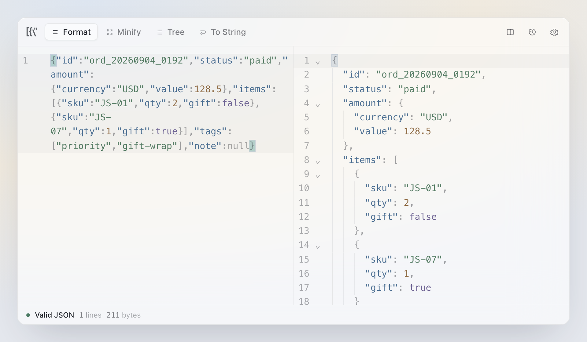
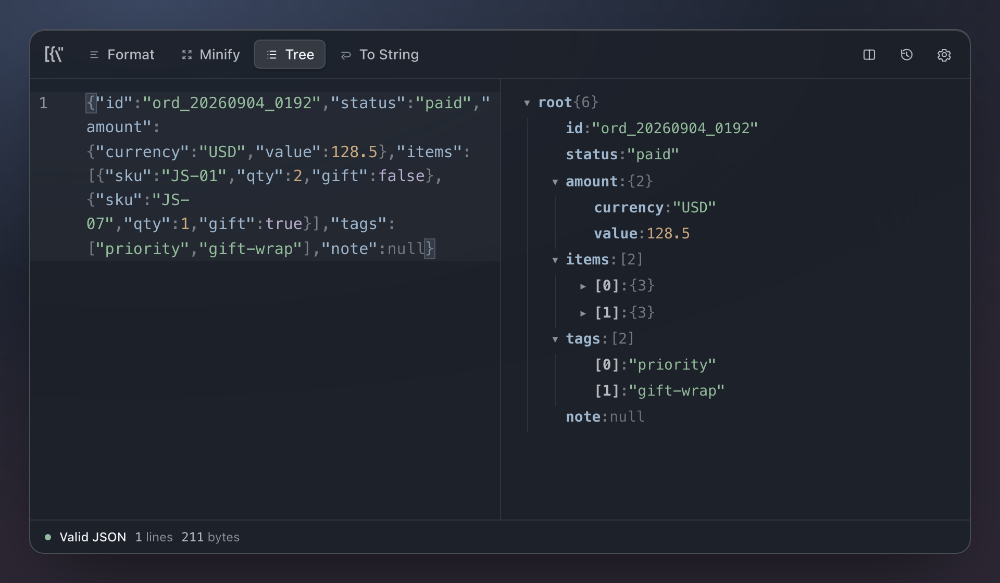
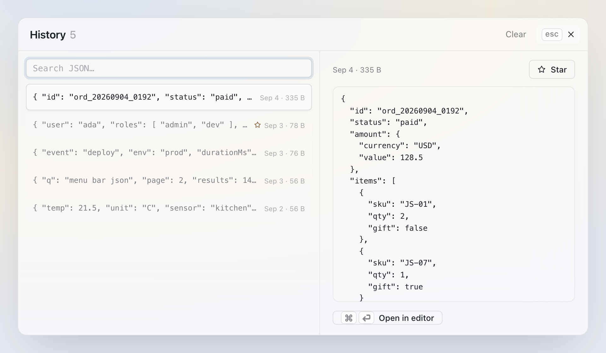
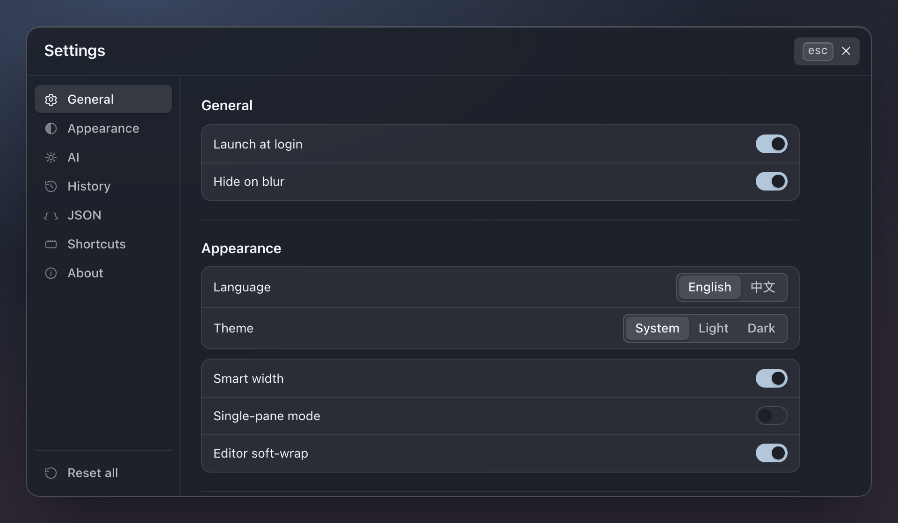

<p align="center">
  
</p>

<h1 align="center">Jsonita</h1>

<p align="center">
  <strong>A tiny menu-bar JSON toolkit for macOS &amp; Windows.</strong><br>
  Press <kbd>⌘⇧J</kbd> from any app — format, minify, traverse, unwrap, and AI-fix JSON without leaving your keyboard.
</p>

<p align="center">
  <a href="https://project.huangjin.online/jsonita/">Website</a> ·
  <a href="https://project.huangjin.online/jsonita/zh-CN/">中文站</a> ·
  <a href="https://github.com/jinhuang712/jsonita/releases/latest">Download</a> ·
  <a href="CLAUDE.md">Contracts</a>
</p>

<p align="center">
  
  
  
</p>

---

Jsonita lives in your menu bar and appears the instant you press the global shortcut. Paste JSON, get a formatted result in under 300 ms, switch transforms with one keystroke, and dismiss it just as fast. Everything stays on your machine — the only time anything is sent anywhere is when you explicitly ask AI to repair a broken document.

**Local by default · window shows in P95 < 500 ms · steady memory < 80 MB · install < 15 MB.**

## Screenshots

<p align="center">
  
  
</p>
<p align="center">
  
  
</p>

## Features

| Feature | What it does |
|---|---|
| **Format** | Indent 2 / 4 / tab, sort keys, trailing newline — all configurable |
| **Minify** | Collapse to a single line |
| **Tree view** | Expand / collapse nodes with type-colored values; read-only |
| **JSON ⇄ String** | Escape to a string or parse a string back; round-trips through multiple nesting layers |
| **Nested unwrap** | Unwrap multiply-stringified payloads (e.g. Go/proto double-wrap) in one shot, with a hard timeout so it can never hang |
| **AI Auto-Fix** | Paste almost-JSON → the AI Fix tab appears → review a diff → Accept. OpenAI-compatible and Anthropic providers, using your own API key |
| **History** | Local SQLite, automatic dedupe, star to keep, opens with <kbd>⌘Y</kbd> |
| **Custom shortcut** | Rebind the global hotkey with conflict detection |
| **Smart width** | The window widens for long lines and collapses for short ones |
| **i18n** | English and 简体中文, switchable in Settings |

## Privacy

- History, settings, window state, and your API key are stored locally — nothing syncs anywhere.
- Your API key is kept in the app data directory with restricted file permissions (no system Keychain).
- Logs never record JSON content, API keys, or AI prompts and responses.
- AI Fix only fires when you click it, and sends only the document you're looking at — nothing until you press Accept.

## Install

### Download (recommended)

Grab the latest build from [**GitHub Releases**](https://github.com/jinhuang712/jsonita/releases/latest):

- **macOS** — download the `.dmg`, open it, and drag **Jsonita.app** into `/Applications`. Launch once, then press <kbd>⌘⇧J</kbd> anywhere.
- **Windows** — download the `.exe` and run it (per-user install, no admin needed), then press <kbd>Ctrl⇧J</kbd>.

> v1 is a small beta. macOS builds are unsigned and Windows builds are unsigned — this is noted in each release. Signed macOS builds and a Homebrew cask land in v1.1.

### Build from source

Requires Rust ≥ 1.77, Node ≥ 20, pnpm ≥ 9 (plus Xcode Command Line Tools on macOS).

```bash
git clone https://github.com/jinhuang712/jsonita.git
cd jsonita
pnpm install
pnpm tauri dev          # dev mode (first build takes a few minutes)
```

Release builds:

```bash
pnpm release:macos:dmg      # macOS .dmg  → release-artifacts/macos-dmg/
pnpm release:macos:app      # macOS .app  → release-artifacts/macos-app/
pnpm release:windows:exe    # Windows NSIS .exe (run on Windows + MSVC)
pnpm release:all            # everything buildable on the current platform
```

## Usage

1. Launch the app. There's no Dock icon — a single-color mark appears in the menu bar.
2. Press <kbd>⌘⇧J</kbd> from any app; the window appears centered without stealing focus.
3. Paste JSON → the formatted result shows within ~300 ms, with `● valid` in the status bar.
4. Switch tabs: **Format** · **Minify** · **Tree** · **To String**.
5. Paste **invalid** JSON → the **AI Fix** tab appears → click it → review the diff → Accept.
6. <kbd>⌘K</kbd> clear · <kbd>⌘\\</kbd> single ⇄ split pane · <kbd>⌘↵</kbd> apply · <kbd>Esc</kbd> close.
7. Open **Settings** (⚙) to change language, theme, the shortcut, and your AI key.

Hiding the window keeps your workspace in memory; quitting ends the process and later restoration uses only saved data. If the global shortcut fails to register, you can still open Jsonita from the menu bar.

## System requirements

- **macOS** 11 Big Sur or later (arm64 / x86_64)
- **Windows** 10 or later (x86_64; unsigned NSIS installer, beta)

macOS is the primary v1 target; Windows ships as a secondary unsigned beta. Homebrew, an auto-updater, an npm wrapper, and Windows code signing are deferred to v1.1+.

## Documentation

| Path | Contents |
|---|---|
| [`CLAUDE.md`](CLAUDE.md) / [`AGENTS.md`](AGENTS.md) | Product contracts, behavior invariants, and release boundaries (kept byte-identical) |
| [`WORKFLOW.md`](WORKFLOW.md) | How docs and implementation stay in sync |
| [`design/`](design/) | Screen hierarchy, visible states, and a low-fidelity (低保真) flow prototype at `design/prototype/index.html` |
| [`docs/`](docs/) | GitHub Pages site source and Superpowers design/plan records |

Change history and open work live in the git commit history — there is no separate changelog or backlog file.

## Uninstall

```bash
# macOS
rm -rf /Applications/Jsonita.app
rm -rf ~/Library/Application\ Support/Jsonita    # history, settings, window state, API key
rm -rf ~/Library/Logs/Jsonita                    # logs
```

## License

[MIT](LICENSE) © 2026 Jin Huang
