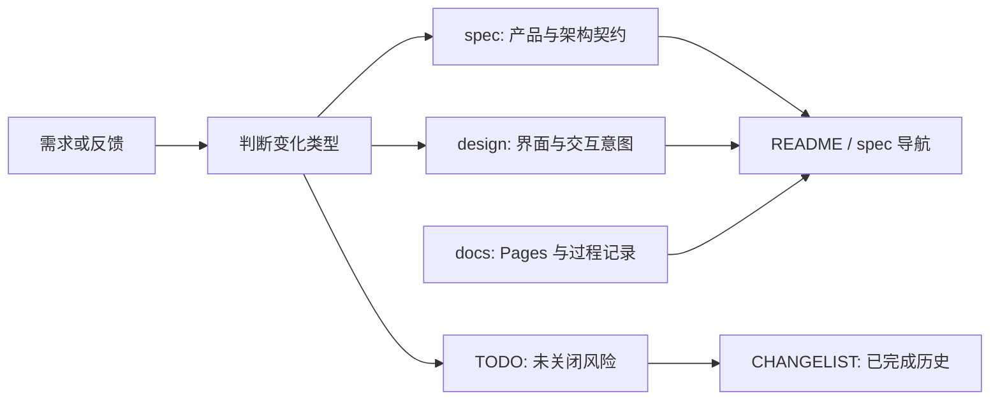

# WORKFLOW · 文档与实现协作流程

本文件定义 Jsonita 的需求、设计、实现与验收如何保持一致。它只规定
文档职责和更新顺序；产品事实由 `spec/`、界面意图由 `design/`、过程记录
与 GitHub Pages 内容由 `docs/` 承担。

## 文档职责



| 位置 | 负责什么 | 不负责什么 |
| --- | --- | --- |
| `spec/` | 产品范围、行为、架构、运行保障、验证门禁 | 像素样式、函数签名、SQL、完整 prompt、命令抄录 |
| `design/` | 屏幕层级、用户可见状态、交互意图、简单流程原型 | 高保真视觉稿、实现细节、历史探索集 |
| `docs/` | GitHub Pages 内容与 Superpowers 设计/计划过程记录 | 取代正式 spec 的产品承诺 |
| `TODO.md` | 尚未关闭的风险、验证与用户待决项 | 已完成事项或旧排期 |
| `CHANGELIST.md` | 已完成的有意义变更与决策背景 | 开放 backlog |

## Spec 结构

`spec/` 是 Jsonita 的正式设计与架构入口：

| 文件 | 内容 |
| --- | --- |
| `00-product.md` | 产品定位、范围、非目标与权威边界 |
| `10-behavior.md` | 用户动作、结果与不可突破的行为承诺 |
| `20-architecture.md` | 模块职责、数据流、边界与不变量 |
| `30-operations.md` | 本地数据、隐私、可靠性、日志与发布保障 |
| `40-validation.md` | 文档、前端、Tauri 与发布变更的验证门禁 |

每篇 spec 必须说明其拥有的决策、依赖关系与失败时的用户结果。代码、测试和
脚本是精确实现细节的权威；spec 只保留读者理解产品和系统所需的稳定边界。

## 变更流程

| 变化 | 更新位置 |
| --- | --- |
| 产品范围、用户行为、架构边界、数据或发布承诺 | 对应 `spec/*.md` |
| 屏幕结构、可见状态、键盘流程或交互意图 | `design/*.md`；必要时更新简单原型 |
| 精确样式、组件实现、schema、SQL、prompt、命令 | 源码、测试或脚本；仅在 spec 中说明边界 |
| 未关闭风险或需要验证的事实 | `TODO.md` |
| 已完成的迁移和决策 | `CHANGELIST.md` |
| Superpowers 的设计/实施过程或 GitHub Pages 页面 | `docs/` |

跨文档变更在 `CHANGELIST.md` 顶部增加一节，至少说明变更、影响文件与原因。

## Design 规则

`design/` 是实现前后的共同语言，不是第二套高保真应用。它应让读者快速理解
主页面、状态和交互结果；精确颜色、间距、CSS 与组件结构以实际源码为准。

`design/prototype/index.html` 只承载可点击的低保真流程。它不要求真实窗口尺寸、
完整状态矩阵、主题切换或与运行时逐像素对齐。Markdown 不得超链接到仓库内
HTML 文件；如需提及原型，使用路径文字。

## 提交前验证

文档变更至少运行：

```bash
git diff --check
diff -u AGENTS.md CLAUDE.md
```

并检查 Markdown 链接存在、README 与 spec 导航一致、没有将已完成
事项留在 TODO。若变更涉及原型，运行对应 Node 测试；若涉及实现或 Tauri 配置，
按 `spec/40-validation.md` 选择验证命令。
