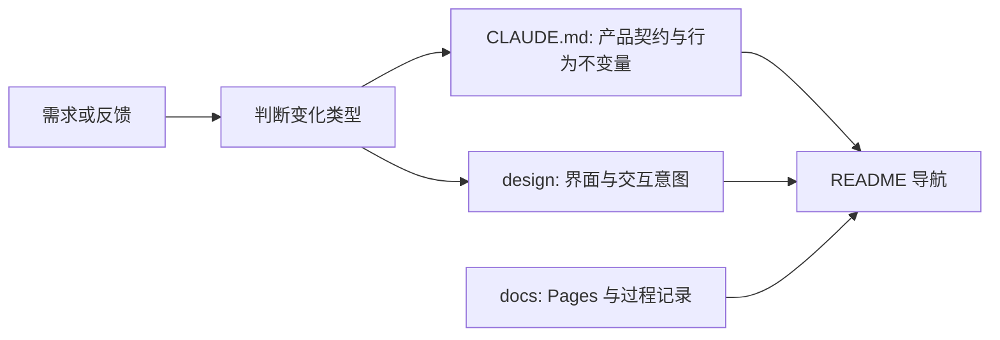

# WORKFLOW · 文档与实现协作流程

本文件定义 Jsonita 的需求、设计、实现与验收如何保持一致。它只规定
文档职责和更新顺序；产品契约由 [CLAUDE.md](CLAUDE.md) 承载、界面意图由
`design/`、过程记录与 GitHub Pages 内容由 `docs/` 承担。变更历史与未关闭事项
由 git 提交历史承载，不再单独维护 changelog / backlog / spec 文件。

## 文档职责



| 位置 | 负责什么 | 不负责什么 |
| --- | --- | --- |
| `CLAUDE.md` / `AGENTS.md` | 产品范围、契约、行为不变量、发布边界、验证门禁 | 像素样式、函数签名、SQL、完整 prompt、命令抄录 |
| `design/` | 屏幕层级、用户可见状态、交互意图、简单流程原型 | 高保真视觉稿、实现细节、历史探索集 |
| `docs/` | GitHub Pages 内容与 Superpowers 设计/计划过程记录 | 取代产品契约的承诺 |
| git 提交历史 | 变更历史、已完成迁移与决策背景 | 稳定产品契约（归 `CLAUDE.md`） |

`CLAUDE.md` 与 `AGENTS.md` 必须字节一致（`diff -u AGENTS.md CLAUDE.md` 为空）。
产品契约只保留读者理解产品和系统所需的稳定边界；代码、测试和脚本是精确实现
细节的权威。

## 变更流程

| 变化 | 更新位置 |
| --- | --- |
| 产品范围、用户行为、架构边界、数据或发布承诺 | `CLAUDE.md` 契约段（同步 `AGENTS.md`） |
| 屏幕结构、可见状态、键盘流程或交互意图 | `design/*.md`；必要时更新简单原型 |
| 精确样式、组件实现、schema、SQL、prompt、命令 | 源码、测试或脚本 |
| 未关闭风险或需要验证的事实 | `CLAUDE.md` 契约段说明，或落为 GitHub Issue |
| 已完成的迁移和决策 | git 提交信息（历史即记录） |
| Superpowers 的设计/实施过程或 GitHub Pages 页面 | `docs/` |

跨文档变更用一条清晰的 git 提交信息说明变更、影响文件与原因。

## Design 规则

`design/` 是实现前后的共同语言，不是第二套高保真应用。它应让读者快速理解
主页面、状态和交互结果；精确颜色、间距、CSS 与组件结构以实际源码为准。

`design/prototype/index.html` 只承载可点击的低保真流程。它不要求真实窗口尺寸、
完整状态矩阵、主题切换或与运行时逐像素对齐。Markdown 不得超链接到仓库内
HTML 文件；如需提及原型，使用路径文字。

## 提交前验证

文档变更至少运行：

```bash
git diff --check
diff -u AGENTS.md CLAUDE.md
```

并检查 Markdown 链接存在、README 导航一致。若变更涉及原型，运行对应 Node
测试；若涉及实现或 Tauri 配置，按 `CLAUDE.md` 的 Validation 段选择验证命令。
