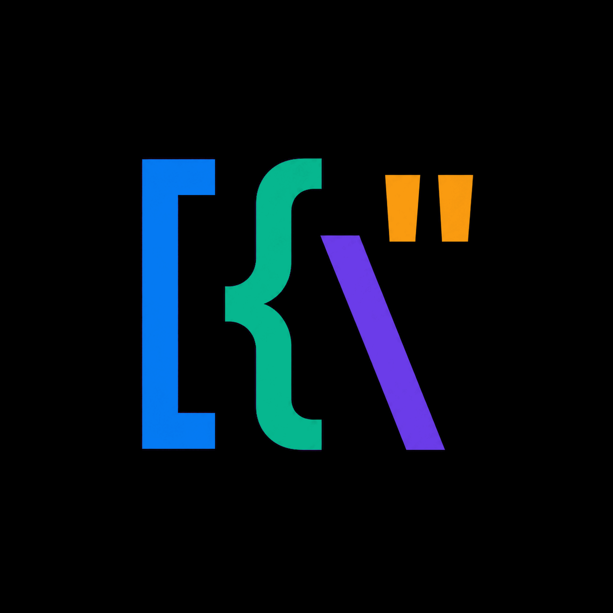

SPEC · 章节 05

# 图标资源 & 主题

manifest.json 全景 · 各资源的用法与路径 · 主题切换时的图标选择策略。

## 1资源全景

所有图标在 `assets/icons/`，源头 master 在 `assets/` 根。一张 `manifest.json` 锁定所有路径、尺寸与调色板， 所有代码引用必须经过 manifest，不允许硬编码字面量。

### 1.1四张 source master（设计源）


icon.png

1254² · RGB · 白底


icon-light-2048

2048² · RGBA · 白底



icon-dark-2048

2048² · RGBA · 黑底


icon-mark-transparent

2048² · RGBA · 透明

### 1.2目录结构

| 路径 | 说明 |
| --- | --- |
| `assets/icon.png` | 1254×1254 RGB · 源 logo（设计稿） |
| `assets/icon-light-2048.png` | 2048² RGBA · 适配亮主题（白底用） |
| `assets/icon-dark-2048.png` | 2048² RGBA · 适配暗主题（黑底用） |
| `assets/icon-mark-transparent-2048.png` | 2048² RGBA · 仅 mark（透明底） |
| `assets/icons/manifest.json` | 资源清单（权威源） |
| `assets/icons/light/png/` | 多尺寸亮主题 PNG（16/24/32/48/64/128/256/512/1024/2048） |
| `assets/icons/dark/png/` | 多尺寸暗主题 PNG（同上） |
| `assets/icons/macos/Jsonita-Light.icns` | macOS bundle icon（亮） |
| `assets/icons/macos/Jsonita-Dark.icns` | macOS bundle icon（暗） |
| `assets/icons/macos/Jsonita-Light.iconset/` | 中间产物（保留以便重新 iconutil） |
| `assets/icons/macos/Jsonita-Dark.iconset/` | 中间产物（保留以便重新 iconutil） |
| `assets/icons/windows/jsonita-light.ico` | Windows ICO（亮） |
| `assets/icons/windows/jsonita-dark.ico` | Windows ICO（暗） |
| `assets/icons/menubar/jsonita-menubar-template-18.png` | 18pt @1x · template-style（macOS） |
| `assets/icons/menubar/jsonita-menubar-template-18@2x.png` | @2x retina |
| `assets/icons/menubar/jsonita-menubar-template-18@3x.png` | @3x |
| `assets/icons/menubar/jsonita-menubar-template-22.png` | 22pt（更大的菜单栏配置） |
| `assets/icons/menubar/jsonita-menubar-template-22@2x.png` | @2x retina |
| `assets/icons/menubar/jsonita-menubar-template-22@3x.png` | @3x |
| `assets/icons/menubar/jsonita-menubar-light-{18,22}{,@2x,@3x}.png` | 亮菜单栏专用（黑色 mask） |
| `assets/icons/menubar/jsonita-menubar-dark-{18,22}{,@2x,@3x}.png` | 暗菜单栏专用（白色 mask） |

## 2调色板（与图标同源）

下面 4 个品牌色出自 `manifest.json` 的 `palette` 字段 ── 它们既是图标里实际使用的色块，也直接映射成设计 token（详见 [02 设计令牌](03_design_tokens.md) ）：

Brand Blue #245BDB · --primary logo 主色 · 应用 primary

Green #237B4B · --ok 状态 OK / json-string

Purple #6F4FD8 · --json-bool JSON boolean 类型

Orange #3F4A5A · --accent AI Fix · inline code

Surface · Light #FFFFFF light theme 浮窗 / 卡片

Surface · Dark #000000 dark master 背景（实际 token `--bg` 用 #161A20）

INFO

图标设计风格按 manifest 锁定为 flat source-derived export; no shadow, no gradient, no rounded corners ── 圆角由 macOS / Windows 系统在生成预览时自行处理（macOS 自动套 squircle）。

## 3资源类别详表

### 3.1Source masters（设计源）

| 文件 | 尺寸 | 背景 | 用途 |

| --- | --- | --- | --- |

| `icon.png` | 1254² RGB | 白 | 设计稿源；不直接进 bundle |

| `icon-light-2048.png` | 2048² RGBA | 白 | 派生 macOS Light icns / Windows light ico |

| `icon-dark-2048.png` | 2048² RGBA | 黑 | 派生 macOS Dark icns / Windows dark ico |

| `icon-mark-transparent-2048.png` | 2048² RGBA | 透明 | 派生菜单栏 template/light/dark；文档 favicon |

### 3.2派生多尺寸 PNG（icons/light|dark/png/）

派生尺寸： 16 / 24 / 32 / 48 / 64 / 128 / 256 / 512 / 1024 / 2048 （manifest.json `pngSizes` ）。下面用 light 派生展示 5 档典型尺寸，所有图片按 px-perfect 渲染：


16 px

menu item · tray fallback


32 px

favicon · 小型 list


64 px

设置 About · 弹层 hero


128 px

About · GitHub README


256 px

高 DPI 分享卡片

| 使用场景 | 尺寸 |

| --- | --- |

| App / docs favicon asset | 32 |

| HTML 内 logo（设置 About） | 64 / 128 |

| 分享卡片 / GitHub Social Preview | 1024 |

### 3.3macOS .icns（Bundle 主图标）

| 文件 | 取自 | 用途 |

| --- | --- | --- |

| `Jsonita-Light.icns` | icon-light-2048.png 经 iconset → iconutil | Light Bundle |

| `Jsonita-Dark.icns` | icon-dark-2048.png 同上 | Dark Bundle（v1 不上 App Store，仅本地切换用） |

iconset 内尺寸 （macOS HIG 要求齐全）：

```

icon_16x16.png         icon_16x16@2x.png
icon_32x32.png         icon_32x32@2x.png
icon_128x128.png       icon_128x128@2x.png
icon_256x256.png       icon_256x256@2x.png
icon_512x512.png       icon_512x512@2x.png

```

下面是 `Jsonita-Light.iconset/` 的 5 个典型尺寸（@1x），按实际像素渲染，可直观对比小尺寸 → 大尺寸的清晰度：


icon_16x16

Finder list 视图


icon_32x32

Quick Look · 通知


icon_128x128

Dock 大图标


Dark · 128 px

Dark bundle iconset

合成命令 （提交前一次性 generate）：

```

iconutil -c icns assets/icons/macos/Jsonita-Light.iconset \
                 -o assets/icons/macos/Jsonita-Light.icns
iconutil -c icns assets/icons/macos/Jsonita-Dark.iconset \
                 -o assets/icons/macos/Jsonita-Dark.icns

```

### 3.4Windows .ico

multi-resolution ICO，内含 16 / 24 / 32 / 48 / 64 / 128 / 256 七档（manifest `windows.sizes` ）。展示 light / dark 两套 .ico 实际渲染（浏览器自动取最大可用档）：


jsonita-light.ico

7-size multi-res · 24 KB


jsonita-dark.ico

同上 · dark 主色

构成 ICO 的源 PNG 档（来自 light/png/）：

 16

 24

 32

 48

 64

 128

 256 → 128

```

# ImageMagick / magick CLI
magick assets/icons/light/png/icon-16.png \
       assets/icons/light/png/icon-24.png \
       ... \
       assets/icons/light/png/icon-256.png \
       assets/icons/windows/jsonita-light.ico

```

### 3.5菜单栏 tray 图标（macOS 关键）

菜单栏对图标有严格要求： 必须是 alpha mask （黑/白单色），由系统按 menu bar 背景自适应反色。三种 variant：

| variant | 颜色 | 用途 |

| --- | --- | --- |

| `template` | 黑色 alpha mask（macOS NSImage template） | v1 默认 ── 让 macOS 自动反色（最佳实践） |

| `light` | 黑色 alpha mask | menubar 背景为亮色时手动用（兜底，正常不该需要） |

| `dark` | 白色 alpha mask | menubar 背景为暗色时手动用 |

| logical size | 对应 macOS | scales |

| --- | --- | --- |

| 18 pt | 普通 menu bar（旧 macOS / 紧凑模式） | @1 (18×18) · @2 (36×36) · @3 (54×54) |

| 22 pt | 较大 menu bar（macOS Big Sur+ 默认） | @1 (22×22) · @2 (44×44) · @3 (66×66) |

实际 18 个文件预览 ── 上排模拟亮色 menubar 背景，下排模拟暗色 menubar 背景：

#### 22 pt × 三 variant × 三 scale（亮色背景）

 light @1x

 light @2x

 light @3x

 template @1x

 template @2x

 template @3x

#### 22 pt × 三 variant × 三 scale（暗色背景 ── dark variant 白色 mask 显形）

 dark @1x

 dark @2x

 dark @3x

 template @1x（系统反色）

 template @2x（系统反色）

 template @3x（系统反色）

#### 18 pt（旧 macOS · 紧凑模式）

 light @1x

 light @2x

 light @3x

 template @1x

 template @2x

 template @3x

OK

用 template variant 一招吃遍：把 `jsonita-menubar-template-{18,22}{,@2x,@3x}.png` 设为 NSImage `template = true`，macOS 会自动按 menubar 当前色（含点击高亮）反色。 不要 手动判断亮 / 暗。

## 4资源在代码中的使用映射

### 4.1Tauri bundler（tauri.conf.json）

```

{
  "bundle": {
    "icon": [
      "../assets/icons/macos/Jsonita-Light.icns",
      "../assets/icons/windows/jsonita-light.ico",
      "../assets/icons/light/png/icon-32.png",
      "../assets/icons/light/png/icon-128.png",
      "../assets/icons/light/png/icon-128@2x.png",
      "../assets/icons/light/png/icon-256.png",
      "../assets/icons/light/png/icon-512.png",
      "../assets/icons/light/png/icon-1024.png"
    ],
    ...
  }
}

```

Tauri 按平台从此列表挑：macOS 用 `.icns`；Windows 用 `.ico`；Linux（v1 不打）用 png。

### 4.2Tray icon（菜单栏）

```

// src-tauri/src/system/tray.rs
use tauri::{tray::TrayIconBuilder, image::Image, AppHandle};
use std::path::PathBuf;

const TRAY_TEMPLATE_18:    &str = "icons/menubar/jsonita-menubar-template-18.png";
const TRAY_TEMPLATE_18_2X: &str = "icons/menubar/jsonita-menubar-template-18@2x.png";
const TRAY_TEMPLATE_18_3X: &str = "icons/menubar/jsonita-menubar-template-18@3x.png";
// 22pt 同理

pub fn build_tray(app: &AppHandle) -> tauri::Result<()> {
    let icon = Image::from_path(resolve_resource(app, TRAY_TEMPLATE_18))?;
    // 关键：macOS 必须 set template = true
    #[cfg(target_os = "macos")]
    let icon = icon.as_template(true);

    let tray = TrayIconBuilder::with_id("main")
        .icon(icon)
        .menu(&build_menu(app)?)
        .on_tray_icon_event(|tray, event| {
            // 左键：toggle window；右键：show menu
            ...
        })
        .build(app)?;
    Ok(())
}

```

注意：tauri-rs `Image` 当前不直接支持 @2x/@3x 多尺寸自动选择。需要：

选项 A（v1）：固定用 22pt @2x（44×44）── 在所有 retina 屏幕上质量足够，非 retina 屏会被系统按比例缩小

选项 B（v1.1+）：实现 multi-scale NSImage（需要直接调 cocoa crate）

### 4.3Dock 图标 / About / 设置面板 logo

React 端通过 Vite 静态资源 import：

```

// src/settings/About.tsx
import logoLight from '/assets/icons/light/png/icon-128.png';
import logoDark  from '/assets/icons/dark/png/icon-128.png';
import { useTheme } from '@/theme/ThemeProvider';

export function AboutLogo() {
  const { effective } = useTheme();
  return ;
}

```

### 4.4App / docs favicon asset

`src/index.html` 与文档素材引用同一套 favicon asset：`assets/icons/light/png/icon-32.png` + `icon-32@2x.png`。

```

<!-- src/index.html head -->
<link rel="icon" type="image/png" sizes="32x32"
      href="../assets/icons/light/png/icon-32.png">
<link rel="icon" type="image/png" sizes="64x64"
      href="../assets/icons/light/png/icon-32@2x.png">
<!-- dark 用浏览器 prefers-color-scheme（可选） -->
<link rel="icon" media="(prefers-color-scheme: dark)"
      href="../assets/icons/dark/png/icon-32.png">

```

## 5主题与图标的耦合

### 5.1哪些图标随主题变？

同一图标 light / dark 直接对比，能瞬间看出 master 的选择策略：


Light bundle · 128 px

macOS Light 模式 · Dock


Dark bundle · 128 px

macOS Dark 模式 · 留备份（v1 不切）


透明底 · 128 px

React About / 文档 favicon 用


Menubar template

macOS 自动反色 · 无需切

| 资源 | 随主题切换 | 策略 |

| --- | --- | --- |

| Bundle 图标（Dock / Finder） | 由 macOS / Windows 决定 | v1 只打 Light 一套（最常见），Dark 留备份；切 dark 时 Dock 仍是 Light 图标 ── macOS 也是这种行为（Safari / Finder 都不换） |

| 菜单栏 tray | 系统自适应 | template variant → macOS 自动反色，无需 React 干预 |

| About / 设置 logo | 跟 effective theme | React 切换 light/dark png（见 § 4.3） |

| HTML 文档 favicon | 不切 | 浏览器自行处理 prefers-color-scheme |

| 启动 splash | — | 不做（见 [03 § 7](04_components.md) ） |

### 5.2JSON 类型颜色与图标同源

JSON 树 / 编辑器的类型染色直接复用 manifest 调色板， 视觉上和 logo 是一套：

| JSON 类型 | light | dark | 同源 |

| --- | --- | --- | --- |

| key | `#245BDB` | `#8AADFF` | primary 蓝 |

| string | `#15803D` | `#67C288` | logo 绿（深化） |

| number | `#245BDB` | `#A9C1FF` | 蓝色派生 |

| boolean | `#6F4FD8` | `#B7A4FF` | 冷紫，区分布尔值 |

| null | `#8F959E` | `#646A73` | 中性 |

## 6资源生成 / 校验脚本

提供一个 `scripts/icons.ts` 工具脚本：

```

// scripts/icons.ts（pnpm tsx scripts/icons.ts）
//
// 命令：
//   icons check    校验 manifest.json 中所有路径文件都存在 + 尺寸匹配
//   icons regen    从 master 重新生成所有派生 png + .icns + .ico
//   icons clean    清除所有派生（保留 master + manifest）

import sharp from 'sharp';
import { execSync } from 'node:child_process';
import fs from 'node:fs/promises';
import path from 'node:path';

const ROOT = path.resolve(__dirname, '..');
const MANIFEST = JSON.parse(
  await fs.readFile(path.join(ROOT, 'assets/icons/manifest.json'), 'utf8'),
);

async function regen() {
  // 1. master → pngSizes 派生（light + dark）
  for (const variant of ['light', 'dark'] as const) {
    const master = path.join(ROOT, MANIFEST.masters[variant]);
    for (const size of MANIFEST.pngSizes) {
      const out = path.join(ROOT, `assets/icons/${variant}/png/icon-${size}.png`);
      await sharp(master).resize(size, size).png().toFile(out);
    }
  }
  // 2. 派生 → .iconset → .icns
  for (const variant of ['Light', 'Dark']) {
    execSync(`iconutil -c icns assets/icons/macos/Jsonita-${variant}.iconset \\
              -o assets/icons/macos/Jsonita-${variant}.icns`);
  }
  // 3. 派生 → .ico
  for (const variant of ['light', 'dark']) {
    const inputs = MANIFEST.windows.sizes
      .map((s: number) => `assets/icons/${variant}/png/icon-${s}.png`).join(' ');
    execSync(`magick ${inputs} assets/icons/windows/jsonita-${variant}.ico`);
  }
  // 4. menubar 模板（透明 master → 黑 / 白 alpha mask + 多 scale）
  await genMenubar();
}

async function check() {
  // 遍历 manifest 所有路径，确认文件存在且尺寸正确
  // 失败则 process.exit(1)
}

```

CI 集成：

`pre-commit hook` 跑 `icons check` ，提交前确保派生 ↔ master 一致

`master 改了但派生没更新` → hook 失败，提示运行 `pnpm icons regen`

## 7不变量

I-1 ：任何代码引用图标必须用 manifest.json 中的路径常量， 不写字面量

I-2 ：menubar 图标必须 set `template = true` （macOS）； 不 手动判 light/dark

I-3 ：派生 PNG / icns / ico 不进 git LFS；保留 manifest + master 即可，CI 派生

I-4 ：图标 master 改动须同时改 manifest.json palette 字段（如颜色微调）

I-5 ：所有暴露给 UI 的颜色（logo 同源色）必须与 design tokens（ [02](03_design_tokens.md) ）一致
