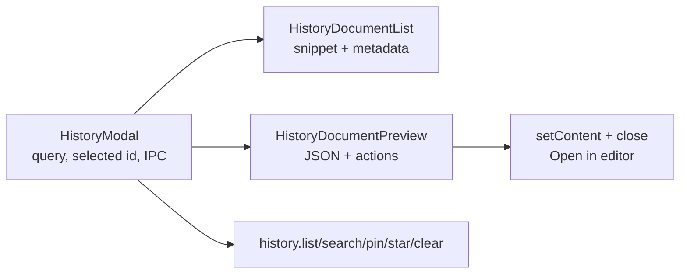

# History Document Library Design

## Goal

Turn History from an operation-log list into a compact local JSON library: a
user scans previous JSON snippets in a denser left rail, reads one selected
document on the right, and explicitly opens that JSON back in the editor.

## Decisions

| Area | Decision |
| --- | --- |
| Page shell | Keep the existing full-window `HistoryModal` page, title `History (N)`, `Esc`, and the shared Quiet Glass surface. |
| Layout | Use a two-column content area: 53% document rail and 47% reading pane. The page must remain compact within the existing shell; it is not a nested card or a separate modal. |
| Left rail | Search stays in the rail. Each record is a 42px, one-line JSON excerpt plus localized date and byte size. Do not render `opType`, operation chips, derived top-level-key titles, `summary`, or per-row action buttons. |
| Right pane | Selecting a row only changes the preview. The pane shows localized date/size metadata, original JSON text, and one primary `CmdOrCtrl+Enter` **Open in editor** action anchored at the bottom-right. The shortcut is not duplicated in the metadata row. |
| Pin / star | Preserve existing SQLite metadata and clear protection. Pin and Star move to quiet controls for the selected document in the preview header. A compact 12px shared SVG communicates a pinned/starred state in the rail; no text glyph such as `⌖` is allowed. |
| Clear | Preserve current behaviour: pinned and starred rows stay when clearing. No schema, IPC-command, or migration change is required. |

## Architecture

`HistoryModal` remains the business shell: it owns querying, selected row id,
IPC mutations, the editor hand-off, and the local `CmdOrCtrl+Enter` listener.
It composes two presentation components:

`HistoryDocumentList` and `HistoryDocumentPreview` are props-only React
components. They do not call Tauri IPC or Zustand stores. Formatting helpers
live in `historyPresentation.ts` and use browser `TextEncoder` and `Intl`, so
the UI can calculate byte size and localized metadata without expanding the
Rust `HistoryRow` contract.

## Interaction and Failure Behaviour

1. Opening History fetches up to the existing 80 rows and selects the first
   result. Refreshes retain the selected id when it is still present; otherwise
   select the first available row.
2. Typing a query continues to use the existing `history_search` command;
   clearing it returns to `history_list`. Search does not change the stored
   document, pin state, or editor content.
3. Clicking a rail row selects it. Clicking **Open in editor** or pressing
   `CmdOrCtrl+Enter` applies the selected row to the editor and closes History.
4. Pin and Star actions mutate only the selected row through the existing
   commands, then reload the list. Failure keeps the editor untouched and
   surfaces the existing History error state.
5. If list/search fails, show the error in the rail and leave the preview
   unavailable. If no rows match, show the localized empty state and disable
   the open action.

## Accessibility and Visual Constraints

- Rail rows use listbox / option semantics with `aria-selected`; pin/star
  controls have localized `aria-label`, `title`, and `aria-pressed` state.
- The bottom action is a real button and includes a `kbd` rendering of
  `formatAccelerator('CmdOrCtrl+Enter')`.
- Reuse `--surface-quiet`, `--surface-raised`, `--control-*`, `--primary-*`,
  `--border`, `--font-ui`, and `--font-code`; do not add an independent colour
  palette or a third-party component library.
- The 53/47 split is the desktop default. Both columns use `minmax(0, …)` and
  overflow inside their own panels so narrow app windows cannot push the shell
  wider than its remembered bounds.

## Non-goals

- No JSON title field, document renaming, folders, tags, cloud sync, history
  schema migration, or new IPC command.
- No operation trace, operation-type badges, or per-row Pin/Star buttons.
- No change to transform success, history write, retention, or local-data
  privacy semantics.

## Verification

Run the new History source-contract tests first (red, then green), followed by
the full Node suite, TypeScript check, Vite production build, `git diff
--check`, and the AGENTS/CLAUDE parity check. Rebuild and replace the local
macOS app with `pnpm deploy:local:macos`, then inspect the populated History
page at the normal application size.
