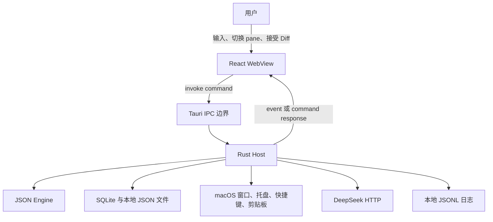
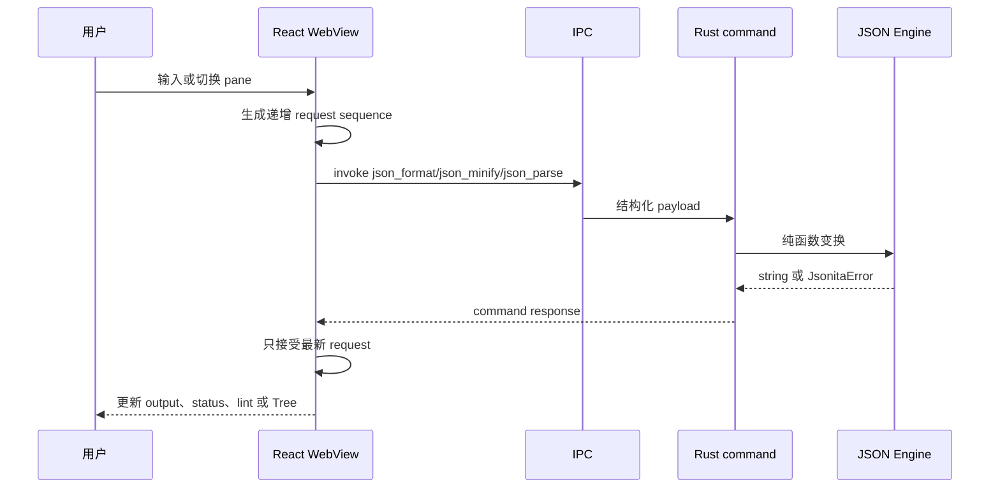
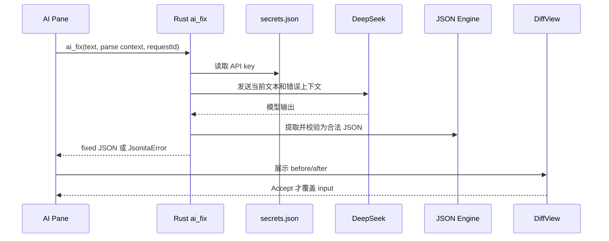
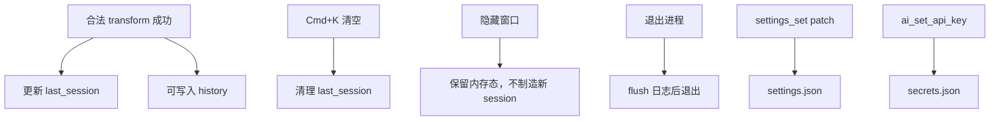

# 系统架构

Jsonita 是一个小型 macOS 菜单栏 JSON 工具，但它不是一个“小网页套壳”。它把交互、系统能力、纯 JSON 计算和本地持久化切成几个明确的世界，让用户可以快速呼出、放心粘贴 JSON、失败后继续编辑，并且知道哪些数据永远留在本机。

## 一句话边界

React WebView 负责用户看见和操作的一切；Rust host 负责系统能力、持久化、网络、日志和 JSON domain；两者之间只能通过 Tauri IPC 交换结构化意图和结果。

这张图是整个 spec 的根。后面的文档只解释其中某一条线，不重新定义整体分层。

## 两个执行世界

| 世界 | 运行位置 | 拥有什么真相 | 只能缓存什么 | 不能越界做什么 |
| --- | --- | --- | --- | --- |
| React WebView | `src/` | 当前可见状态：editor 文本、active pane、preview 结果、Tree 展开、AI Diff 决策 | settings snapshot、错误显示、pending request 状态 | 不能直接读写文件、SQLite、secrets、系统快捷键、网络、日志文件。 |
| Rust Host | `src-tauri/src/` | 持久化、系统能力、JSON engine、AI client、日志 writer | command 临时输入、service 内部缓存 | 不直接修改 DOM，不决定具体 UI 布局。 |

WebView 是“可见状态权威”，Rust 是“能力和持久化权威”。这句话比“前后端分离”更重要，因为它直接决定失败时谁能回滚、谁能忽略过期结果、谁能写入 durable state。

## 能力只能穿过哪些门

| 能力 | 唯一入口 | Rust owner | 关键命令或事件 |
| --- | --- | --- | --- |
| JSON 变换 | IPC command | `cmds::json`、`engine::*` | `json_format`、`json_minify`、`json_parse`、`json_stringify`、`json_unwrap_stringified` |
| History 与 last session | IPC command | `store::history`、`store::session` | `history_add`、`history_list`、`session_save_last`、`session_load_last`、`session_clear_last` |
| Settings | IPC command + event | `store::settings` | `settings_get_all`、`settings_set`、`settings_reset`、`settings:changed` |
| Window 与生命周期 | Rust setup + IPC + event | `window::*`、`cmds::window` | `window_show`、`window_hide`、`window_toggle`、`window:shown`、`window:will-hide` |
| AI Fix | IPC command | `cmds::ai`、`ai::*`、`store::secrets` | `ai_fix`、`ai_set_api_key`、`ai_test_connection`、`ai_has_api_key` |
| 日志 | Rust writer + thin frontend logger | `logging::*` | `open_log_dir`、前端诊断事件、Rust tracing event |
| 系统动作 | IPC command 或 Rust setup | `shortcuts::*`、`menubar::*`、`cmds::system` | `shortcut_register`、`shortcut_status`、`clipboard_read`、`quit_app` |

完整 command 签名在 [appendix/ipc-api.md](appendix/ipc-api.md)，但这些名字必须在核心文档中出现，因为它们影响 coding agent 如何定位代码。

## 三条主数据流

### 1. 本地 JSON 变换

这条路径的核心不变量是：preview 不自动覆盖 input；engine 失败不写 history；过期响应不能覆盖新输入。

### 2. AI 修复

AI 不是自动修复器，而是“外部建议 + 本地校验 + 用户确认”的决策流。它的详细契约在 [08_ai_repair.md](08_ai_repair.md)。

### 3. 持久化与恢复

`history` 和 `last_session` 是两个不同账本：history 用于查询过去，last_session 用于恢复上次明确可恢复的编辑状态。不要把窗口隐藏、退出或失败 preview 写成新的恢复目标。

## 不变量

| 不变量 | 为什么存在 | 破坏后的后果 |
| --- | --- | --- |
| 前端不拥有 durable truth | 避免 WebView bug 直接污染本地数据和 secrets | settings、history、session 会与 Rust 真相漂移。 |
| Rust 不拥有可见 editor 状态 | 避免异步 command 覆盖用户正在编辑的新内容 | 旧 preview 或慢 AI 结果会闪回。 |
| JSON engine 保持纯函数 | 便于单测、复用和错误定位 | parse 失败可能产生副作用或半写入。 |
| API key 只在 `secrets.json` | 与 settings、日志、event payload 隔离 | key 可能被 UI payload、日志或导出泄漏。 |
| 日志不记录 JSON 内容 | support 只需要诊断，不需要用户数据 | 日志变成隐私风险。 |
| 版本号必须一致 | About、bundle、release、日志和 support 对齐 | 用户安装包和源码状态无法追踪。 |

## 跨层失败停在哪里

失败语义不是“抛异常”。架构层要求失败停在正确边界：

| 失败 | 停靠边界 | 用户可见结果 | 数据规则 |
| --- | --- | --- | --- |
| `Parse` | JSON engine 返回到前端 | editor lint 和 invalid 状态，Tree 不渲染，可出现 AI Fix 入口 | input 保持，history/last_session 不因失败写入。 |
| `UnwrapTimeout` | JSON engine | 提示 unwrap 超时，可关闭 auto unwrap 或调整阈值 | 不返回半成品，不覆盖 input。 |
| `Secrets` | Rust secrets store | Settings 不显示保存成功；AI Fix 不发 HTTP | key 不进 settings/event/log。 |
| `RateLimit` / `Http` | Rust AI client | AI pane 显示状态码或 retry-after，Diff 不出现 | 原 input 保持，request context 可用于重试。 |
| `AiInvalidJson` | Rust 输出校验 | 不显示 Accept，提示模型结果不可用 | fixed JSON 不进入 editor。 |
| `Sqlite` / `Io` | Rust storage 或 filesystem | 当前编辑可继续，保存/恢复动作显示失败 | 不伪造 history/session/settings 成功态。 |
| Tauri transport failure | IPC 边界 | 通用基础设施失败，建议重试或查看日志 | 前端不能把缺失 response 当成功。 |

完整错误模型见 [04_error_model.md](04_error_model.md)。架构文档只定义原则：失败不丢 input，不假装成功，不跨越权限边界。

## FAQ

**为什么 JSON engine 不放在前端？**
因为 JSON engine 是可测试的 domain 逻辑，不应该被 React 状态、浏览器事件或 UI 生命周期污染。Rust 侧还能统一错误类型和性能边界。

**为什么 WebView 不能直接读文件或发网络？**
WebView 是交互层，不是权限层。所有文件、SQLite、secrets、DeepSeek HTTP、日志写入都穿过 Rust，才能集中审计、脱敏和失败处理。

**为什么 Rust 不直接改 UI？**
用户输入变化比 command response 更快。Rust 只能返回结果或 event，前端按 request sequence 和当前可见状态决定是否展示，才能避免旧结果覆盖新输入。

**如果只改一个小功能，还要读这篇吗？**
要。Jsonita 的 bug 常出现在边界：一个看似 UI 的按钮可能写 settings，一个看似 JSON 的失败可能影响 last_session。先读架构地图能避免改错 owner。

## 相关明细

- 完整 IPC command/event 和 payload 字段见 [appendix/ipc-api.md](appendix/ipc-api.md) 与 [appendix/schemas.md](appendix/schemas.md)。
- JSON engine 细节见 [06_json_engine.md](06_json_engine.md) 和 [appendix/json-engine-details.md](appendix/json-engine-details.md)。
- 数据所有权见 [07_storage_session.md](07_storage_session.md)。
- 安全与隐私边界见 [05_security_privacy.md](05_security_privacy.md)。
