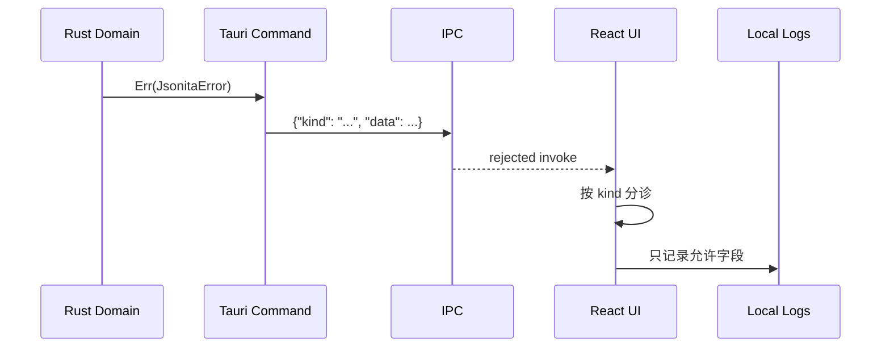
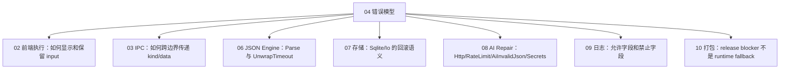

# 错误模型

Jsonita 的错误模型不是 enum 文档，而是一套失败分诊规则：当某件事失败时，系统要知道还能不能继续、用户该看到什么、哪些状态必须保持不变、哪些副作用必须阻断，以及日志能记录到什么程度。

一句话定义：失败语义 = 触发点 + 不变量 + 用户可见结果 + 可恢复动作 + 日志边界。

## 目标：不丢数据、不假成功、可行动

| 目标 | 含义 | 反例 |
| --- | --- | --- |
| 不丢数据 | 失败不能覆盖用户当前 input，不能用半成品替换 editor。 | AI 返回非法 JSON 但仍允许 Accept。 |
| 不假成功 | 写 settings、secrets、history、release metadata 失败时不能显示成功态。 | API key 保存失败但按钮显示已保存。 |
| 可行动 | 用户能知道下一步是修改 JSON、稍后重试、打开权限、检查日志还是停止 release。 | 只有一个 “Something went wrong”。 |
| 可追踪 | 日志能定位模块、kind、requestId、状态码或位置。 | 日志只有字符串错误，或者记录了用户 JSON 全文。 |

## 错误如何穿过系统

Rust 业务失败统一进入 `JsonitaError`。前端可以本地化文案，但不能丢掉 `kind` 和影响行为的 payload。没有 `kind` 的失败是 transport 或前端本地异常，不能伪造成业务错误。

## `JsonitaError` 分诊矩阵

| Error kind | 典型触发点 | 必须保持不变 | 阻断什么 | 用户可见结果 | 可恢复动作 | 日志允许字段 |
| --- | --- | --- | --- | --- | --- | --- |
| `Parse` | `json_format`、`json_minify`、`json_parse`、AI 输出校验前的 JSON 解析 | 当前 input | preview 成功态、Tree 渲染、history/last_session 写入 | invalid 状态，CodeMirror lint 使用 `line/col/msg`，可显示 AI Fix 入口 | 用户继续编辑或请求 AI Fix | `kind`、`line`、`col`、command、duration；不能写原文。 |
| `UnwrapTimeout` | `json_unwrap_stringified` 递归解包超时 | 当前 input 和原始 JSON 结构 | 返回半成品、自动 apply | unwrap 超时提示 | 降低输入规模、关闭 auto unwrap、调高阈值 | `kind`、`ms`、`depth`；不写 JSON。 |
| `Sqlite` | history、last_session、migration、query/write | editor 内存态 | 假装历史已保存、假装 session 可恢复 | history/session action 失败 | 继续编辑、查看日志、重启 | `kind`、store action、错误摘要；不写 content。 |
| `Secrets` | `secrets.json` 读写、AI 读取 key | API key 不外泄，settings 不含明文 key | API key 保存成功态、AI HTTP 请求 | settings 显示保存失败或 AI key 缺失 | 修正权限、重新输入 key、重试 | `kind`、operation；不能写 key 或完整 raw path。 |
| `Http` | DeepSeek 非 rate-limit HTTP 错误 | 原 input、AI request context | Diff Accept、自动重写 input | AI pane 显示状态码摘要 | 检查网络、模型、key，重试 | `kind`、`status`、requestId、duration；body 需要截断和脱敏。 |
| `AiInvalidJson` | 模型响应存在但提取/校验不是合法 JSON | 原 input | Accept、history/session 写入 | 提示模型返回不可用结果，Diff 不出现 | 重试或手动修复 | `kind`、requestId；`raw` 默认不入日志。 |
| `RateLimit` | DeepSeek 429 或带 retry-after | 原 input、AI pane 当前上下文 | 立即重复请求、Diff Accept | 显示 retry-after | 稍后重试 | `kind`、`retryAfterSec`、requestId、status。 |
| `Io` | settings/window/log/system file 或 Tauri error | durable old value 或当前 editor | 假成功、半写状态 | action 失败提示 | 重试、检查权限、查看日志 | `kind`、operation、错误摘要。 |
| `AiDisabled` | settings 禁用时调用 `ai_fix` | 原 input | AI HTTP 请求 | AI disabled 提示或禁用入口 | 打开 settings 启用 AI | `kind`、operation；不写 prompt。 |

这张表是失败语义的权威定义。其他 core spec 可以补充本模块场景，但不要重新定义这些 kind 的含义。

## 用户动作决策表

| 当前失败 | UI 是否继续可编辑 | 是否可重试 | 是否需要用户配置 | 是否允许写 durable state |
| --- | --- | --- | --- | --- |
| `Parse` | 是 | 用户改输入后自然重试 | 否 | 否，直到合法 transform。 |
| `UnwrapTimeout` | 是 | 是，改阈值或输入后重试 | 可能需要 settings | 否。 |
| `Sqlite` | 是 | 是 | 可能需要修复文件权限或数据库 | 失败动作不可算成功。 |
| `Secrets` | 是 | 是 | 是，key 或权限 | 不能保存 key 成功态。 |
| `Http` | 是 | 是 | 可能需要网络/key/model | 不能写 AI fixed result。 |
| `AiInvalidJson` | 是 | 是 | 否 | 不能写 AI fixed result。 |
| `RateLimit` | 是 | 稍后 | 否 | 不能写 AI fixed result。 |
| `Io` | 取决于动作 | 是 | 可能 | 不能假装写成功。 |
| `AiDisabled` | 是 | 启用后 | 是 | 不进入 AI flow。 |

## 模块如何引用这个模型

每个模块要写自己的失败场景，但必须落到这里的分类。例如 AI 文档可以说明 `RateLimit` 在 AI pane 怎么展示，却不能把 `RateLimit` 解释成“普通 HTTP 错误可忽略”。

## 常见错误处理反模式

| 反模式 | 为什么错 | 应该怎么做 |
| --- | --- | --- |
| catch 后只 `String(e)` | 丢失 `kind` 和 payload，UI 无法分诊 | 用 `isJsonitaError` 分支处理。 |
| parse 失败时清空 output 和 input | 用户丢失工作内容 | input 永远保持，output/status 按当前输入更新。 |
| settings 写失败但 toggle 仍停在新值 | UI 显示和 durable truth 分裂 | 回到 Rust 返回的真实 settings 或显示失败。 |
| AI invalid JSON 仍显示 Diff | 用户可能接受不可用结果 | 禁止 Accept，提示模型输出不可用。 |
| 日志记录 raw prompt 或 JSON | support 变成隐私风险 | 只记录 kind、requestId、状态码、位置等诊断字段。 |
| release 产物 metadata 不一致仍发布 | 用户无法追踪版本 | 阻断 release，不存在 runtime fallback。 |

## 与日志的关系

错误模型决定“日志要足够诊断但不能越界”。最低日志粒度：

| 场景 | 应有字段 | 禁止字段 |
| --- | --- | --- |
| JSON parse | event、command、kind、line、col、durationMs | input/output/content。 |
| AI HTTP | event、requestId、kind/status、durationMs、retryAfterSec | prompt、rawPrompt、用户 JSON、API key。 |
| storage | event、store action、kind、path category | SQLite row content、JSON document。 |
| secrets | event、operation、kind | key、token、明文 secrets path 细节。 |
| release | version、tag、artifact name、sha256、validation result | 本地凭证、签名密码。 |

完整日志字段见 [appendix/logging-details.md](appendix/logging-details.md)。

## FAQ

**为什么“失败语义”不能只写“抛错并提示用户”？**
因为不同失败的副作用不同。`Parse` 允许继续编辑，`Secrets` 必须阻断保存成功态，`AiInvalidJson` 必须禁止 Accept，release metadata 错必须阻断发布。

**哪些错误可以继续编辑？**
几乎所有 runtime 错误都不应该锁死 editor。区别在于相关功能是否可继续：JSON 可继续编辑，AI 可能暂停，history/session 可能暂时不可用。

**哪些错误必须阻断？**
阻断的是对应动作：API key 写失败阻断保存成功，AI disabled 阻断 HTTP，invalid AI output 阻断 Accept，版本不一致阻断 release。阻断动作不等于清空 editor。

**如果前端拿不到 `JsonitaError.kind` 呢？**
按 transport 或未知基础设施失败处理。不能猜测业务 kind，也不能写 durable success。

## 相关明细

- 完整 `JsonitaError` schema 和 TypeScript mirror 见 [appendix/schemas.md](appendix/schemas.md)。
- command 到错误分支的明细见 [appendix/ipc-api.md](appendix/ipc-api.md)。
- AI 上游错误和 prompt/response 细节见 [appendix/ai-protocol.md](appendix/ai-protocol.md)。
