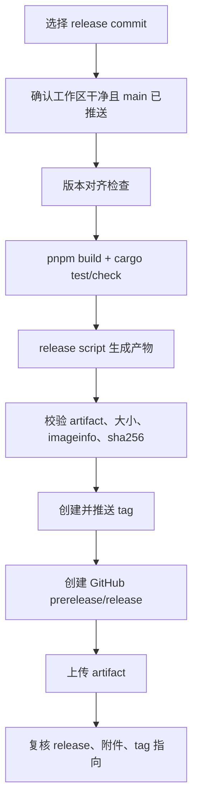

# 打包与分发

打包 spec 决定一个 commit 什么时候可以变成用户手里的安装包。它不是“跑一下构建脚本”，而是一组 release gate：版本是否对齐、产物是否正确、权限是否最小、签名策略是否符合发布范围、失败是否阻断发布。

## v1 beta 发布决策

v1 beta 的主路径是 GitHub Releases + macOS `.dmg`，用于小范围内部测试。这个阶段允许无签名/未公证的内部 beta，但必须在 release notes 中明确说明；公开分发前必须补齐 signing/notarization。

v1.1+ 之后再进入：

- Homebrew Cask。
- Tauri updater metadata。
- npm wrapper 或更广泛分发。
- 稳定下载 URL 和 sha256 自动化。

这些不属于当前 macOS beta 主链路，因为它们需要稳定 release URL、签名策略、更新通道和长期维护承诺。

## Release Pipeline

任何一步失败都停止 release。打包失败没有 runtime fallback；metadata 错也不能靠用户自己理解来补救。

## Version Alignment Gate

| 位置 | 字段 | 为什么必须一致 |
| --- | --- | --- |
| `package.json` | `version` | 前端构建、npm metadata、release notes 入口。 |
| `src-tauri/Cargo.toml` | `[package].version` | Rust binary、日志 `CARGO_PKG_VERSION`。 |
| `src-tauri/tauri.conf.json` | `version` | Tauri bundle metadata 和 DMG 命名。 |
| About panel | visible version | 用户 support 截图和反馈依据。 |
| Git tag | `v<version>` | GitHub Release 和源码 commit 绑定。 |

版本漂移必须阻断发布。用户看到的版本、安装包 metadata、日志版本和 GitHub tag 必须指向同一件事。

## Artifact Contract

| 产物 | 命令 | 平台 | v1 beta 状态 | 验证方式 |
| --- | --- | --- | --- | --- |
| macOS DMG | `pnpm release:macos:dmg` | macOS | 主产物 | 文件存在、`hdiutil imageinfo`、sha256、GitHub asset。 |
| macOS APP | `pnpm release:macos:app` | macOS | 本地 smoke test 产物 | app bundle 可启动。 |
| Windows NSIS | `pnpm release:windows:exe` | Windows | 脚本支持，非当前主链路 | Windows runner 和签名策略。 |
| All current platform | `pnpm release:all` | 当前平台 | 聚合入口 | 按各产物规则验证。 |

当前 bundle 关键配置：

| 配置 | 值 | 影响 |
| --- | --- | --- |
| `productName` | `Jsonita` | app 和 DMG 显示名。 |
| `identifier` | `com.jsonita.app` | macOS bundle id，发布后长期稳定。 |
| macOS minimum | `11.0` | 用户安装兼容边界。 |
| bundle targets | `dmg`、`app` | 当前 macOS 产物范围。 |
| network exception | `api.deepseek.com` | AI Fix 允许的外部 API。 |
| default DMG name | `Jsonita_<version>_universal.dmg` | release asset 和后续 sha256 引用。 |

完整 Tauri 配置、capabilities、entitlements 和 env 变量见 [appendix/packaging-details.md](appendix/packaging-details.md)。

## 签名、公证和权限边界

| 发布范围 | signing/notarization 要求 | 用户沟通 |
| --- | --- | --- |
| 本地开发 | 可跳过 | 不发布。 |
| 小范围内部 beta | 可用 `TAURI_NO_SIGN=1` 跳过，但 release notes 必须说明未公证 | 用户需要知道 macOS 可能拦截。 |
| 公开 release | 必须完成 Developer ID signing 和 notarization | 不应要求普通用户绕过系统安全提示。 |

capabilities 和 entitlements 保持最小化。DeepSeek 网络例外只服务 AI Fix，不代表 WebView 可以任意外发。

## Release Blocker Matrix

| Blocker | 触发点 | 为什么阻断 | 允许的修复 |
| --- | --- | --- | --- |
| 工作区 dirty | release 前 | 产物无法追踪源码状态 | 提交或清理改动。 |
| 本地 main 未推送 | tag/release 前 | tag 可能指向远端没有的 commit | push main。 |
| 版本不一致 | version gate | 用户、日志、bundle、tag 对不上 | 同步所有版本 marker。 |
| `pnpm build` 失败 | validation | 前端产物不可用 | 修复 TypeScript/Vite 错误。 |
| `cargo test` 或 `cargo check` 失败 | validation | Rust command 或 engine 不可信 | 修复测试或类型错误。 |
| DMG 未生成 | build artifact | 没有可安装产物 | 修复 Tauri build。 |
| `hdiutil imageinfo` 失败 | artifact inspect | 文件不是有效 DMG | 重新打包。 |
| sha256 缺失 | release notes | 用户无法校验产物 | 生成 checksum。 |
| tag 指向错误 commit | tag/release | release 与源码错位 | 删除/重建 tag，谨慎处理远端。 |
| GitHub asset 缺失 | release verify | 用户下载不到产物 | 重新上传 asset。 |
| public release 未签名/未公证 | public distribution | 用户安全体验不可接受 | 完成 signing/notarization。 |

## 发布后的复核

发布不以命令退出 0 为终点。必须复核：

1. GitHub Release 存在，且不是误 draft。
2. prerelease/release 标记符合发布范围。
3. tag 解引用到目标 commit。
4. asset 名称、大小、sha256 与本地产物一致。
5. release notes 明确签名/公证状态。
6. 本地工作区仍然干净。

## FAQ

**为什么 Homebrew 后置？**
Homebrew Cask 需要稳定 URL、sha256、签名和后续更新承诺。v1 beta 先验证 DMG 和真实用户反馈，不把分发面扩大。

**未签名 beta 能不能发？**
可以发小范围内部 beta，但必须明确未签名/未公证。公开 release 不能这么做。

**metadata 错为什么必须阻断？App 不是能打开吗？**
metadata 是 support、升级、下载、日志和用户信任的一部分。版本或 tag 错会让后续问题无法追踪。

**Windows 脚本存在，为什么当前 release 不发 Windows？**
脚本支持不等于发布链路成熟。Windows 需要对应 runner、签名策略、安装验证和 release notes。

## 相关文档

- 版本和发布目标也受 [WORKFLOW.md](../WORKFLOW.md) 约束。
- 打包命令、Tauri config、capabilities、entitlements、签名变量见 [appendix/packaging-details.md](appendix/packaging-details.md)。
- release history 应写入 [../CHANGELIST.md](../CHANGELIST.md)，未完成项保留在 [../TODO.md](../TODO.md)。
