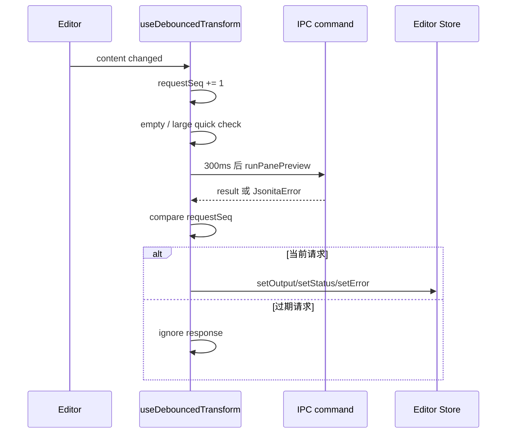
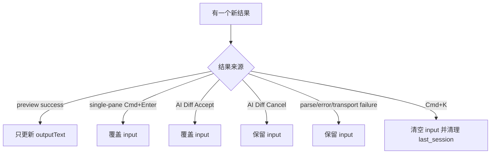
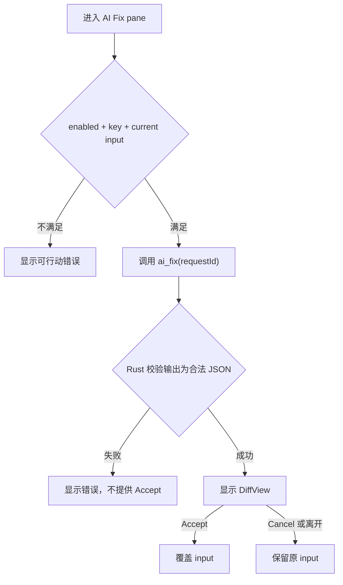

# 前端执行

前端执行层的工作不是“把 Rust 返回值显示出来”这么简单。它要在用户快速输入、pane 切换、preview 异步返回、Tree 本地渲染、AI Diff 决策之间维护一个核心事实：用户当前 editor input 永远是可见编辑的真相，除非用户明确执行覆盖动作。

## 前端是可见状态权威

React WebView 拥有这些可见状态：

| 状态 | 代码位置 | 谁能修改 | 持久化真相在哪里 |
| --- | --- | --- | --- |
| `content` / input text | `src/store/editor.ts` | editor onChange、explicit apply、AI Accept、restore command | 默认只在内存；last_session 由 Rust SQLite 承载。 |
| `outputText` | `src/store/editor.ts` | preview 成功响应 | 不持久化为真相。 |
| `status` | `src/store/editor.ts` | debounce preview、empty/large 判断、parse error | 派生状态，不持久化。 |
| `error` | `src/store/editor.ts` | `Parse` 映射、清空、成功 preview | Rust error payload 是来源。 |
| `activePane` | `src/store/ui.ts` | TabBar 和快捷键 | UI 状态，非 durable truth。 |
| `settings` snapshot | `src/store/settings.ts` | `settings_get_all`、`settings:changed` | Rust `settings.json`。 |
| AI fix state | `src/store/ai.ts`、`src/panes/AiFixPane.tsx` | AI pane request、success、error、Accept/Cancel | 没有 durable truth，Accept 后才进入 editor。 |

WebView 可以缓存 settings、error 和 preview，但它不能直接写 durable 文件，也不能把自己的缓存当成最终状态。

## 一次 preview 如何避免旧结果闪回

`requestSeq` 是前端执行层的关键保护。Rust command 可以慢，AI 可以更慢，用户输入却不会等它们。只有最新请求能更新 `outputText`、`status` 和 `error`。

5 MB 是前端大文件保护阈值。超过阈值时前端进入 `large` 状态，不继续频繁调用 JSON engine。这个阈值是交互保护，不是文件格式语义。

## Pane 执行矩阵

| Pane | 预览命令 | 可见输出 | 是否可 apply 覆盖 input | 失败 UI | 是否写 history/last_session |
| --- | --- | --- | --- | --- | --- |
| Format | `json_format` | pretty JSON | single-pane 下 `Cmd+Enter` | `Parse` 映射到 lint 和 invalid status | 只有合法 transform 成功后可写。 |
| Minify | `json_minify` | compact JSON | single-pane 下 `Cmd+Enter` | `Parse` 映射到 lint 和 invalid status | 只有合法 transform 成功后可写。 |
| JSON to String | `json_stringify` | escaped string literal | single-pane 下 `Cmd+Enter` | parse/escape 失败保留 input | 成功后可写。 |
| String to JSON | `json_parse` | JSON 文本 | single-pane 下 `Cmd+Enter` | unescape/parse 失败保留 input | 成功后可写。 |
| Tree | 本地 `JSON.parse(content)` 渲染 Tree | Tree nodes、path、copy action | 否 | empty/invalid Tree placeholder | Tree 本身不写。 |
| AI Fix | `ai_fix` | DiffView before/after | 只有 Accept | AI error、rate-limit、invalid output 不显示 Accept | Accept 后才可进入后续 transform/session。 |

Format、Minify、String 互转都是“命令返回结果”。Tree 和 AI Fix 是例外：Tree 是当前 input 的只读视图；AI Fix 是外部建议经过本地校验后的用户决策。

## Tree 为什么不是 command

Tree view 的输入是当前 `content`，不是 `outputText`。切到 Tree 时，前端直接用 `JSON.parse(content)` 判断三种状态：

| Tree 状态 | 触发条件 | UI | 数据规则 |
| --- | --- | --- | --- |
| `valid` | 当前 input 可被 `JSON.parse` 解析 | 渲染 `TreeView` | 不改 input，不写 storage。 |
| `empty` | input trim 后为空 | 显示空态 | 不触发 engine。 |
| `invalid` | input 非法 JSON | 显示 Tree unavailable | 不渲染旧树，不覆盖 input。 |

Tree 的复制行为属于交互层：leaf 复制值，object/array 复制 subtree，key 可复制 path。它不能偷偷变成一次 transform，也不能把 Tree 展开状态写入 JSON 内容。

## 输入覆盖白名单

允许覆盖 input 的动作只有三个：

1. single-pane 下用户明确执行 `Cmd+Enter` apply。
2. AI Diff 中用户点击 Accept。
3. 用户明确清空，例如 `Cmd+K`。

preview 成功不是覆盖授权。AI 返回合法 JSON 也不是覆盖授权。transport 成功只代表收到响应，不代表用户同意改原文。

## AI Diff 决策流

DiffView 的 props 和样式属于前端，但 Accept/Cancel 是系统边界：Accept 是唯一把 AI 输出写回 editor 的动作。

## 前端失败矩阵

| 场景 | 触发点 | 不变量 | 用户可见结果 | 可继续动作 | 日志边界 |
| --- | --- | --- | --- | --- | --- |
| `Parse` | preview command 返回 | `content` 不变，旧请求不可覆盖新请求 | status invalid，editor lint 使用 `line/col/msg`，Tree 不渲染 | 继续编辑，或进入 AI Fix | 可记录 `kind=Parse` 和位置，不记录 JSON 文本。 |
| 大文件 | `content.length > 5 MB` | 不继续高频 preview | status large | 用户可删减、手动复制处理 | 不记录内容。 |
| 过期响应 | 慢 command 返回 | 只接受最新 request | 用户无感，不闪回旧结果 | 继续编辑 | 通常不需要日志。 |
| `Io` / transport failure | IPC invoke 失败 | `content` 不变 | 显示基础设施失败或保持可编辑 | 重试、查看日志 | 记录 command 和错误 kind，不记录 payload。 |
| AI `RateLimit` | `ai_fix` 返回 | Diff 不出现，原 input 保持 | 显示 retry-after | 稍后重试 | 记录 retryAfterSec/requestId，不记录 prompt。 |
| AI `AiInvalidJson` | Rust 校验模型输出失败 | Accept 不可见 | 提示模型返回不可用 | 重试或手动修复 | raw output 默认不进日志。 |
| Settings 写失败 | `settings_set` 失败 | durable settings 仍是旧值 | 控件应回到真实状态或显示失败 | 重试保存 | 不记录 secrets 或用户 JSON。 |

## FAQ

**为什么 preview 成功不自动覆盖 input？**
因为 preview 是反馈，不是授权。用户可能只是想看结果、比较、或继续编辑；自动覆盖会破坏可恢复性。

**Tree 明明解析 JSON，为什么不用 Rust command？**
Tree 是当前输入的即时视图，主要消费已经在 WebView 里的文本。它没有持久化副作用，也不需要系统权限。Rust JSON engine 仍是 transform 的权威。

**AI 成功为什么还要 Diff？**
AI 输出即使是合法 JSON，也可能不是用户想要的修复。Diff 是从“模型建议”到“用户确认”的安全阀。

**`session.saveLast` preview 成功后异步失败怎么办？**
前端不能因此撤销 editor 状态。session 失败是持久化失败，不是当前编辑失败；用户可继续编辑，但恢复能力不应假装成功。

## 相关文档

- JSON 操作语义见 [M01-json-engine.md](M01-json-engine.md)。
- AI 修复完整流程见 [M02-ai-repair.md](M02-ai-repair.md)。
- IPC command 和 payload 明细见 [S02-ipc-boundary.md](S02-ipc-boundary.md)、[platform/I01-ipc-api.md](platform/I01-ipc-api.md)、[appendix/A00-schemas.md](appendix/A00-schemas.md)。
- Tree、editor、Diff 的视觉和交互细节见 `design/01_mockups.md`、`design/02_interaction.md`、`design/08_editor.md`。
