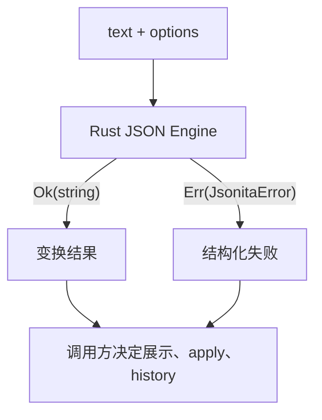
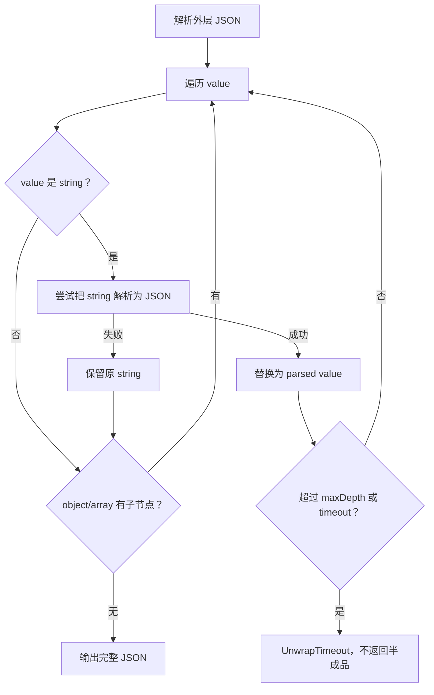

# JSON Engine

JSON Engine 是 Jsonita 最核心也最克制的模块。它只做一件事：把文本和选项变成新的文本，或者返回结构化错误。它不读 settings、不写 history、不知道当前 pane、不知道用户是否想 apply，也不调用 AI。

## 纯函数契约

调用方可以是 live preview、single-pane apply、AI response validator 或 tests。无论是谁调用，engine 不产生持久化副作用。

## 操作语义

| 操作 | 代表 command | 最小行为字段 | 输出 | 错误 kind | 是否允许 partial result | 是否直接写 history |
| --- | --- | --- | --- | --- | --- | --- |
| Format | `json_format` | `FormatOpts.indent`、`sortKeys`、`trailingNewline` | pretty JSON | `Parse` | 否 | 否 |
| Minify | `json_minify` | 无额外选项 | compact JSON | `Parse` | 否 | 否 |
| Sort keys | format option | `sortKeys=true` | 递归排序后的 JSON | `Parse` | 否 | 否 |
| JSON to String | `json_stringify` | `StringifyOpts.quote`、`escapeUnicode`、`minify` | escaped string literal | `Parse` | 否 | 否 |
| String to JSON | `json_parse` | 输入字符串字面量或普通 JSON 字符串 | JSON text | `Parse` | 否 | 否 |
| Unwrap stringified | `json_unwrap_stringified` | `UnwrapOpts.timeoutMs`、`maxDepth` | 解包后的 JSON | `Parse`、`UnwrapTimeout` | 否 | 否 |

字段完整定义见 [appendix/A00-schemas.md](appendix/A00-schemas.md)，算法和测试样例见 [appendix/A02-json-engine-details.md](appendix/A02-json-engine-details.md)。

## 为什么选择 `serde_json`

v1 使用 `serde_json`，不是自研 parser。理由是：

| 取舍 | 结论 |
| --- | --- |
| 严格性 | Jsonita 处理的是 JSON，不是 JSON5、JS object literal 或容错配置语言。 |
| 错误定位 | `serde_json` 能给出 line/column，前端 lint 直接消费。 |
| 顺序保持 | 依赖配置启用 `preserve_order`，默认 format 不打乱用户 key 顺序。 |
| 可测试性 | Rust 纯函数单测覆盖 format、sort、stringify、unwrap。 |
| 成本 | 对 v1 beta 文件规模足够，不需要引入 parser 维护成本。 |

后续只有在明确需要 JSON5、流式超大文件或更丰富 AST diagnostics 时，才重新评估 parser。

## Format 与 key 顺序

默认 format 保持输入 object key 顺序。只有 `sortKeys=true` 时才递归排序 object key。这个字段影响用户可见结果，不能藏在附录里才第一次出现。

`trailingNewline` 默认为 true，用于生成更符合工具链习惯的输出；调用方仍决定是否展示或 apply。

## String 互转边界

JSON to String 的输入仍必须是合法 JSON。它先 parse，再按 quote、unicode escape、minify 选项输出字符串字面量。

String to JSON 的输入可以是外层带引号的 JSON 字符串，也可以是可反转义的字符串内容；失败统一归 `Parse`，因为用户需要修正的是输入语法，不是 storage 或 IPC。

## Unwrap 算法边界

嵌套 stringified JSON 常出现在日志字段、网关 payload 和多层序列化结果里。unwrap 的规则是保守递归：

关键规则：

| 规则 | 行为 |
| --- | --- |
| string 不是合法 JSON | 保持原 string，不报错。 |
| 外层不是合法 JSON | 返回 `Parse`。 |
| 递归超过 `maxDepth` | 停止继续深入，保持当前 value 语义。 |
| 超过 `timeoutMs` | 返回 `UnwrapTimeout`，不返回半成品。 |
| 数字字符串 | 默认保持字符串，避免把业务 ID 误变成 number。 |

`UnwrapTimeout` 是可恢复失败，不是成功结果。前端应保持 input，并提示用户调整设置或关闭 auto unwrap。

## 结果交给谁决定应用和存储

engine 返回 `Ok(string)` 只说明变换成功。后续动作由调用方决定：

| 调用方 | 成功后怎么做 | 失败后怎么做 |
| --- | --- | --- |
| live preview | 更新 `outputText` 和 status | `Parse` 显示 lint，保留 input。 |
| single-pane apply | 用户按 `Cmd+Enter` 后覆盖 input | 不覆盖 input。 |
| AI validator | 校验模型 fixed JSON 可用 | 返回 `AiInvalidJson` 或 parse failure，不显示 Accept。 |
| history/session service | 只在上层确认合法业务动作后写入 | storage 失败不回写 engine。 |

这条边界避免了“engine 成功就自动持久化”这种隐式副作用。

## Engine 失败矩阵

| 场景 | 触发点 | 不变量 | 用户可见结果 | 可继续动作 | 日志边界 |
| --- | --- | --- | --- | --- | --- |
| `Parse` | 外层 JSON、string-to-json、format/minify 解析失败 | input 不变，history/last_session 不写 | line/col lint、invalid status、Tree unavailable | 用户继续编辑或 AI Fix | 写 kind、line、col，不写文本。 |
| `UnwrapTimeout` | 递归 unwrap 超时 | 不返回半成品，input 不变 | unwrap timeout 提示 | 调整 `timeoutMs`/`maxDepth`、关闭 auto unwrap | 写 kind、ms、depth。 |
| sort keys 成功但用户未 apply | preview 成功 | input 不变 | output 显示排序结果 | `Cmd+Enter` 或复制 output | 不需要日志。 |
| string 转换失败 | quote/unescape/parse 失败 | input 不变 | parse 类错误 | 修正字符串 | 写 kind 和位置，若无位置可写 kind。 |

## FAQ

**sort keys 是否递归？**
是。`sortKeys=true` 对 object 递归排序，array 顺序保持，因为 array 顺序是数据语义。

**unwrap 超时为什么不返回已经解开的部分？**
partial result 会让用户误以为得到完整 JSON。超时是失败，必须保持原 input 并让用户决定重试策略。

**为什么数字字符串不自动变 number？**
日志和接口里很多 ID 是数字字符串，自动转换会改变业务语义。unwrap 只解看起来是 JSON object/array/string literal 的内容。

**engine 是否应该读取 settings？**
不应该。settings 由调用方转成 options 传入。engine 不知道用户设置，也不写任何持久化状态。

## 相关文档

- 前端 preview 和 apply 规则见 [M00-frontend-execution.md](M00-frontend-execution.md)。
- 错误分诊见 [S03-error-model.md](S03-error-model.md)。
- 函数签名、fixture 和完整 option 字段见 [appendix/A02-json-engine-details.md](appendix/A02-json-engine-details.md) 与 [appendix/A00-schemas.md](appendix/A00-schemas.md)。
