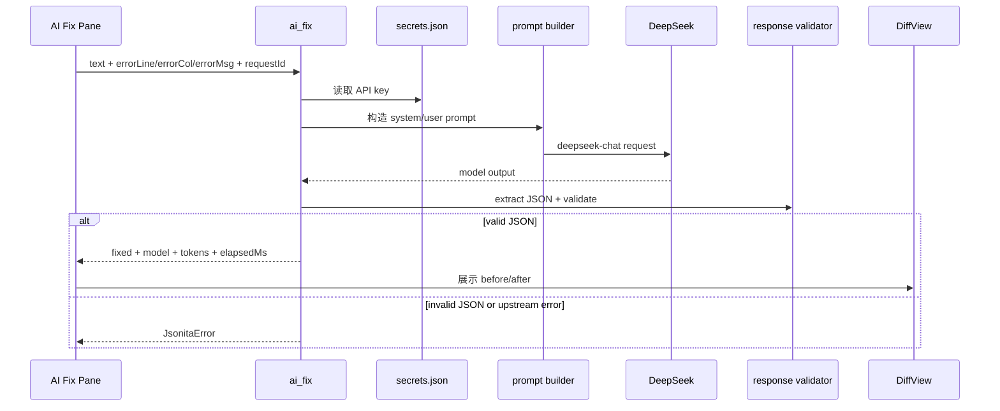
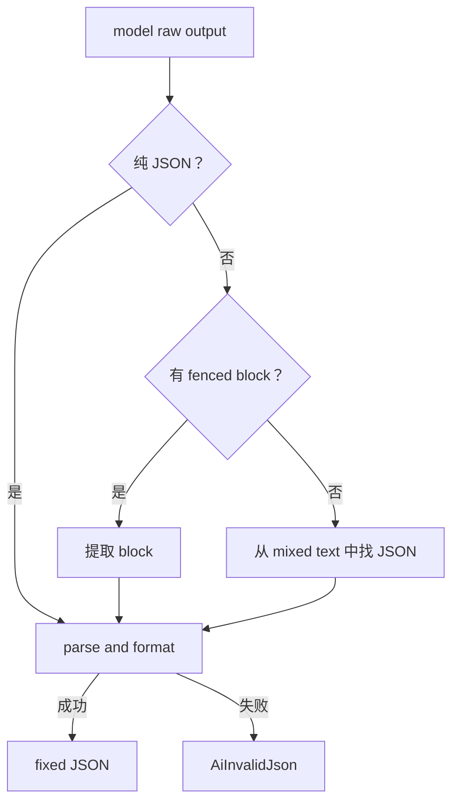
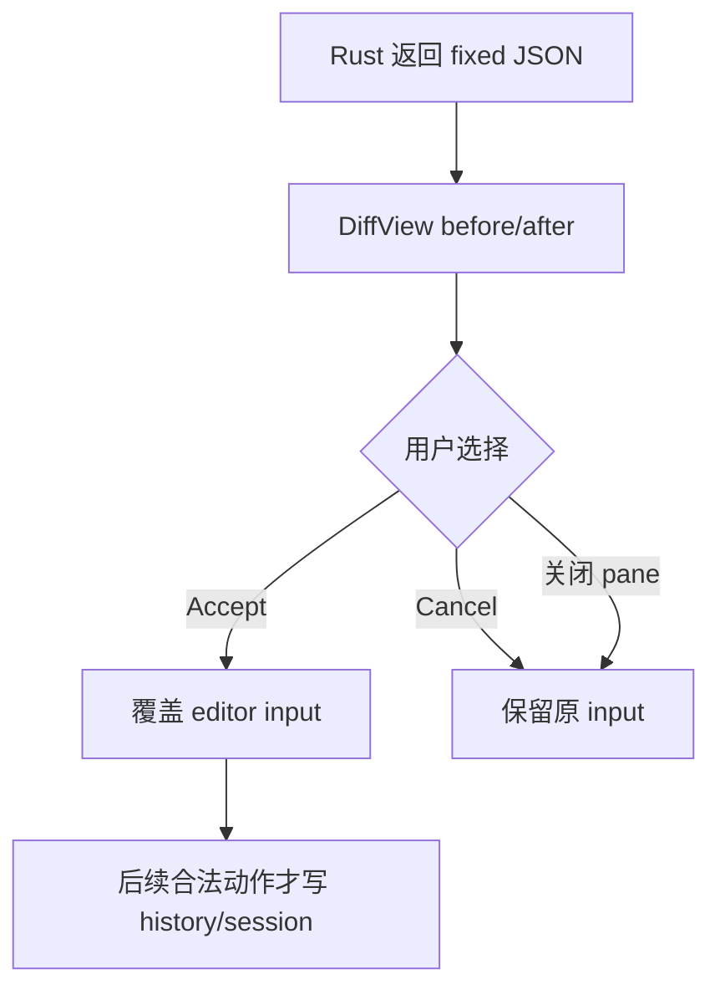

# AI Repair

AI Fix 是可选决策流，不是自动修复。Jsonita 可以请求模型帮忙修 JSON，但模型输出必须经过本地提取、JSON engine 校验和用户 Diff 确认，才能触碰 editor input。

## 运行门禁

AI Fix 只有在这些条件同时成立时才运行：

| Gate | 检查位置 | 失败时 |
| --- | --- | --- |
| `settings.aiEnabled=true` | 前端入口 + Rust `ai_fix` | 返回 `AiDisabled`，不发 HTTP。 |
| `secrets.json` 有 DeepSeek key | Rust secrets store | 返回 `Secrets`，不发 HTTP。 |
| 当前 input 来自 editor | 前端 request | 只发送当前文本，不使用 history。 |
| 有可用 request context | AI pane | 带 parse line/col/msg 更好，没有也必须受限 prompt。 |
| requestId 唯一 | 前端生成 | 防止重复请求和旧响应混淆。 |

前端隐藏入口只是体验优化，Rust gate 才是安全边界。

## 请求链路



请求默认值属于行为级约束：

| 参数 | 默认值 | 原因 |
| --- | --- | --- |
| model | `deepseek-chat` | v1 beta 默认 DeepSeek chat 模型。 |
| temperature | `0` | 修复任务需要确定性，不需要发散。 |
| response format | plain JSON text | v1 必须接受 object 或 array；不能把 array 修复结果判成失败。 |
| timeout | `60s` | AI 允许比本地 transform 慢，但不能无限挂起。 |
| max tokens | 按输入估算 | 避免输出被截断，同时不暴涨请求。 |

Provider 接入契约见 [platform/I00-ai-provider-protocol.md](platform/I00-ai-provider-protocol.md)，完整 wire protocol 见 [appendix/A05-ai-protocol-details.md](appendix/A05-ai-protocol-details.md)。

## Prompt 边界

AI prompt 的目标只有一个：返回修复后的 JSON。它不能变成“解释错误、生成报告、读取历史上下文”的通道。

允许进入 prompt 的内容：

- 当前 editor text。
- parse error 的 `line`、`col`、`msg`。
- 简短规则：只返回 JSON，不返回 Markdown，不返回解释。

禁止进入 prompt 的内容：

- history、last_session、settings 全量配置。
- API key、secrets、日志。
- window state、路径、剪贴板全文。
- support logs 或之前 AI raw output。

## 响应提取与校验

模型可能不完全听话，所以 Rust validator 需要三层提取：

| 响应形态 | 处理 |
| --- | --- |
| 纯 JSON object/array | 直接 parse。 |
| fenced code block | 提取 ```json 或普通 fenced block 内部内容再 parse。 |
| mixed text | 尝试定位首个 JSON object/array 片段，再 parse。 |

提取成功还不够，结果必须被 JSON engine 校验为合法 JSON。失败返回 `AiInvalidJson`，前端不能显示 Accept。

如果模型返回约定失败 sentinel（例如 `{ "_jsonita_repair_failed": true, "reason": "..." }`），即使它本身是合法 JSON，也必须映射为 `AiInvalidJson` 或等价不可用状态。sentinel 表示“模型拒绝给出修复”，不是可接受的修复结果，不能进入 Diff。



## Diff Accept Boundary



模型输出合法 JSON，只说明“它可以被展示给用户比较”。Accept 才表示用户授权覆盖。Cancel、离开 pane、请求失败都保持原 input。

## AI 失败矩阵

| 场景 | 触发点 | 不变量 | 用户可见结果 | 可继续动作 | 日志边界 |
| --- | --- | --- | --- | --- | --- |
| `AiDisabled` | `ai_fix` gate | 不发 HTTP，input 不变 | AI disabled 提示 | 打开 settings 启用 AI | 记录 kind 和 action。 |
| missing key / `Secrets` | 读取 key 或保存 key | key 不进 settings/log，input 不变 | 提示配置或保存失败 | 输入 key、修复权限、重试 | 不写 key。 |
| `Http` | DeepSeek 非 429 错误 | Diff 不出现，input 不变 | 显示状态码摘要 | 检查网络/key/model、重试 | 记录 status/requestId/duration，body 脱敏截断。 |
| `RateLimit` | 429 或 retry-after | request context 可保留，input 不变 | 显示 retry-after | 稍后重试 | 记录 retryAfterSec，不写 prompt。 |
| `AiInvalidJson` | 提取失败、JSON 校验失败或返回 repair failed sentinel | Accept 不可见，input 不变 | 模型结果不可用 | 重试或手动修 | raw 默认不入日志。 |
| stale response | 旧 request 返回 | 最新 input 不被覆盖 | 用户无感或旧 loading 结束 | 继续当前请求 | 可记录 requestId mismatch，无内容。 |

## AI 与其他模块的关系

| 模块 | AI 如何使用它 | 边界 |
| --- | --- | --- |
| JSON Engine | 校验 fixed output 是合法 JSON | engine 不知道 AI，也不写 history。 |
| Secrets | 读取 DeepSeek key | key 不返回前端。 |
| Settings | gate `aiEnabled` 并提供内部 `aiModelId` 默认值 | settings 不包含明文 key；v1 UI 不单独暴露 model 编辑控件。 |
| Frontend | 展示 loading/error/Diff/Accept | AI 结果不自动覆盖。 |
| Logging | 记录诊断字段 | 不记录 prompt、raw JSON、key。 |

进入 AI Fix tab 后，底部状态栏表达 AI Fix 当前状态：requesting 显示修复中，awaiting-decision / error 显示待用户审查或处理，不继续显示底层 parse error 的 `Invalid JSON` 文案。底层 editor error 仍保留给 lint、prompt context 和返回普通编辑态后的状态栏使用。

## FAQ

**AI 关闭时为什么 Rust 还要拒绝？**
前端只是体验层，可能有 bug 或旧状态。Rust gate 才能保证禁用状态下不会外发。

**模型返回合法 JSON 是否一定应用？**
不。合法 JSON 只是进入 Diff 的门票。用户 Accept 才能覆盖 input。

**raw output 能不能进日志？**
默认不能。raw output 很可能包含用户 JSON 或模型复述内容。诊断只记录 kind、requestId、状态码、耗时等允许字段。

**AI Fix 能不能读取 history 提高效果？**
v1 不允许。history 是本地数据，不是 AI 上下文。AI 只处理当前用户明确请求修复的文本。

## 相关文档

- 前端 AI pane 和 input 覆盖规则见 [M00-frontend-execution.md](M00-frontend-execution.md)。
- 安全和外发边界见 [S04-security-privacy.md](S04-security-privacy.md)。
- 错误分诊见 [S03-error-model.md](S03-error-model.md)。
- Provider 接入契约见 [platform/I00-ai-provider-protocol.md](platform/I00-ai-provider-protocol.md)。
- Prompt、wire protocol 和 Diff props 见 [appendix/A05-ai-protocol-details.md](appendix/A05-ai-protocol-details.md)。
- Payload 字段见 [appendix/A00-schemas.md](appendix/A00-schemas.md)。
