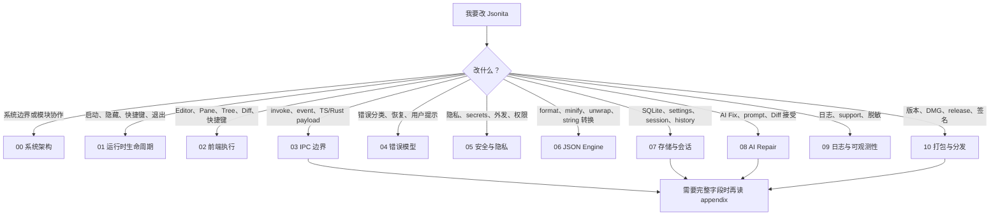

# Spec 阅读入口

Jsonita 的核心 spec 不再是统一模板。每篇文档都从它自己的问题出发：架构文档讲系统地图，生命周期讲状态机，前端文档讲用户操作如何变成状态，IPC 文档讲边界契约，错误文档讲一次失败如何被分诊和恢复。

如果你是 coding agent，默认先读核心 spec；只有在需要完整字段表、SQL、命令签名、prompt 模板、release 命令或测试矩阵时，才进入 [appendix/](appendix/README.md)。

## 快速决策地图

## 核心文档

| 文档 | 这篇文档解决的问题 | 推荐读者 |
| --- | --- | --- |
| [00_system_architecture.md](00_system_architecture.md) | Jsonita 为什么分成 WebView、IPC、Rust domain、本地数据四个世界，以及一次操作如何穿过这些边界。 | 第一次进入仓库的人、跨模块改动者。 |
| [01_runtime_lifecycle.md](01_runtime_lifecycle.md) | 一个菜单栏 App 怎么做到常驻、隐藏、快速呼出、明确退出。 | 改窗口、tray、快捷键、NSPanel 行为的人。 |
| [02_frontend_execution.md](02_frontend_execution.md) | 用户在浮窗里输入、切 pane、看 Tree、接受 AI Diff 时，前端状态如何保护原文。 | 改 React、editor、Tree、AI pane、快捷键的人。 |
| [03_ipc_boundary.md](03_ipc_boundary.md) | 前端为什么不能直接碰文件、网络和系统能力；command/event 如何承载跨边界协作。 | 改 command、payload、event、TS mirror 的人。 |
| [04_error_model.md](04_error_model.md) | “失败语义”到底是什么：失败后谁还能继续、谁要停止、用户看到什么、数据是否改变。 | 改错误、文案映射、重试、恢复流程的人。 |
| [05_security_privacy.md](05_security_privacy.md) | 用户 JSON、API key、日志、AI 请求什么时候留在本地，什么时候允许出境。 | 改 secrets、AI、日志、权限、外发的人。 |
| [06_json_engine.md](06_json_engine.md) | 纯 JSON 变换如何保持可测试、可恢复、无 UI 副作用。 | 改 Rust engine、format/minify/string/unwrap 的人。 |
| [07_storage_session.md](07_storage_session.md) | history、last_session、settings、window、secrets 为什么不能混在一起。 | 改 SQLite、settings、恢复、数据迁移的人。 |
| [08_ai_repair.md](08_ai_repair.md) | AI Fix 从 parse error 到 Diff Accept 的完整审查链路。 | 改 DeepSeek、prompt、AI pane、Diff 的人。 |
| [09_logging_observability.md](09_logging_observability.md) | 本地日志如何帮 support，同时不泄漏 JSON 和 key。 | 改 logging、redaction、support action 的人。 |
| [10_packaging_distribution.md](10_packaging_distribution.md) | 什么样的 commit 可以变成 release，版本、产物、签名、公证如何卡住发布。 | 做 release、打包、版本升级的人。 |

## 主权对象

| 主权对象 | 唯一定义位置 | 其他文档的使用方式 |
| --- | --- | --- |
| 系统分层、跨世界数据流 | [00_system_architecture.md](00_system_architecture.md) | 其他文档引用这个地图，不重新定义整体架构。 |
| App 运行状态机 | [01_runtime_lifecycle.md](01_runtime_lifecycle.md) | window、shortcut、tray、quit 行为以它为准。 |
| 前端可见状态与 input 覆盖规则 | [02_frontend_execution.md](02_frontend_execution.md) | pane、Tree、AI Diff、single-pane apply 不重复解释。 |
| IPC command/event 边界 | [03_ipc_boundary.md](03_ipc_boundary.md) | 完整签名在附录，行为边界只在这里定义。 |
| 失败分诊模型 | [04_error_model.md](04_error_model.md) | 各模块只说明本模块落到哪类失败，不重新发明错误分类。 |
| 本地优先和外发许可 | [05_security_privacy.md](05_security_privacy.md) | AI、logging、storage、packaging 都不能突破这条边界。 |
| JSON 变换语义 | [06_json_engine.md](06_json_engine.md) | UI/IPC/storage 只调用，不重写算法语义。 |
| 数据所有权 | [07_storage_session.md](07_storage_session.md) | SQLite、settings、window、secrets、last_session 只在这里定义主权。 |
| AI 修复审查链 | [08_ai_repair.md](08_ai_repair.md) | prompt 和 wire 明细可查附录，流程以这里为准。 |
| 日志脱敏边界 | [09_logging_observability.md](09_logging_observability.md) | 事件字段明细在附录，隐私边界以这里为准。 |
| 发布门禁 | [10_packaging_distribution.md](10_packaging_distribution.md) | release script 和配置块在附录，能否发布以这里为准。 |

## 附录边界

附录不是“第二套正文”。它只放读正文时不需要背下来的明细：

- 完整 schema、enum、payload 字段。
- 完整 IPC command/event 表。
- SQL DDL、PRAGMA、迁移细节。
- prompt 模板、DeepSeek wire protocol、默认参数。
- 日志字段表、redaction allow/deny list。
- release 命令、Tauri config、entitlements、签名变量。

如果一个字段、状态、事件或规则会直接影响系统行为，它必须先在核心 spec 中被点名；附录只负责展开完整字段和样例。

## Mermaid 使用规则

核心 spec 可以使用 Mermaid，但只使用 GitHub Markdown 稳定支持的保守子集：`flowchart TD`、`sequenceDiagram`、`stateDiagram-v2`。不要使用 ASCII diagram，不要在 Mermaid label 里放 Markdown 链接、HTML 或复杂代码片段。字段名、命令名、事件名放正文或表格里解释。

## 什么是“失败语义”

失败语义不是“这里会报错”。它必须回答四个问题：

| 问题 | 必须写清楚的内容 |
| --- | --- |
| 系统还继续吗？ | 继续编辑、可重试、需要用户动作、阻断发布、阻断启动。 |
| 用户看见什么？ | 状态栏、lint、modal、Diff 禁用、settings 提示、release blocker。 |
| 数据有没有改变？ | input 是否保持、last_session 是否写入、history 是否追加、settings 是否回滚。 |
| 如何恢复？ | 用户改 JSON、重试 HTTP、保存 key、打开权限、重新打包、查看日志。 |

这四个问题是 [04_error_model.md](04_error_model.md) 的核心，也是其他 spec 写失败场景时的最低要求。
