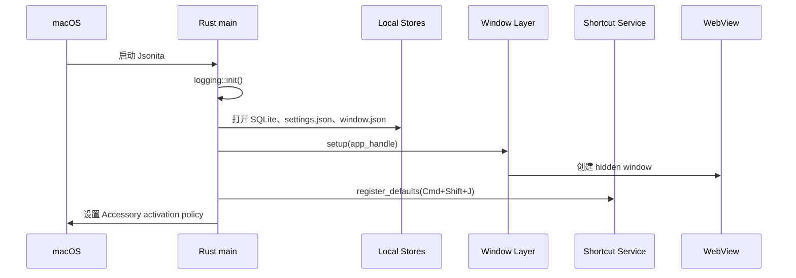
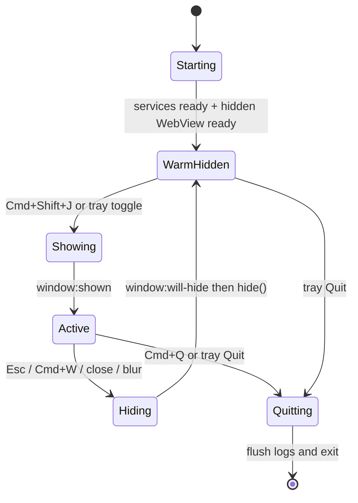

# 运行时生命周期

Jsonita 的运行时体验是“常驻但不打扰”：它像系统工具一样一直在菜单栏里，按 `Cmd+Shift+J` 时立刻出现，用完就藏起来，真正退出必须是用户明确选择。生命周期 spec 关心的不是窗口动画，而是 App 什么时候存在、什么时候可见、什么时候可以恢复，以及失败时用户是否还有路可走。

## 用户感知目标

| 用户动作 | 用户期待 | 系统必须保证 |
| --- | --- | --- |
| 打开 App | 菜单栏图标出现，不抢当前工作流 | Rust services 初始化，WebView 预热但默认不可见。 |
| 按 `Cmd+Shift+J` | 浮窗快速出现 | 全局快捷键到 Rust，再 toggle 已预热窗口。 |
| 按 `Esc` 或 `Cmd+W` | 工具暂时消失 | 隐藏窗口，不销毁 WebView，不清 editor。 |
| 再次呼出 | 刚才状态还在 | 复用内存态，并按当前 settings 渲染。 |
| 选择 Quit | App 真正退出 | 停止常驻、flush 日志、菜单栏图标消失。 |

## 启动链路

启动顺序有意把日志放在最前面，因为启动失败也需要诊断。SQLite 打不开不会直接阻塞 UI，因为用户仍可能只做临时 JSON 变换；窗口创建失败才是启动阻塞，因为没有可交互界面。

Tauri 配置中的 `visible: false` 是生命周期关键字段，不是视觉细节。默认窗口尺寸是 `860 x 560`，最小尺寸是 `440 x 340`；这些值影响预热、智能缩放和恢复策略。release 门禁见 [platform/R00-release-readiness.md](platform/R00-release-readiness.md)，完整配置明细见 [appendix/A04-packaging-details.md](appendix/A04-packaging-details.md)。

## Window State Machine

状态名是行为合约：

| 状态 | Rust 侧行为 | WebView 侧行为 | 用户看到什么 |
| --- | --- | --- | --- |
| `Starting` | 初始化日志、store、tray、window、shortcut | 未必可交互 | 可能只看到菜单栏图标出现。 |
| `WarmHidden` | 监听 tray 和快捷键 | React/CodeMirror 已经加载，窗口隐藏 | 没有浮窗，但下一次呼出快。 |
| `Showing` | 定位屏幕、show、focus 或保持非激活策略 | 收到 `window:shown` 后进入 shown motion | 浮窗出现。 |
| `Active` | 允许 resize/theme/window command | editor、pane、preview 正常工作 | 用户处理 JSON。 |
| `Hiding` | emit `window:will-hide`，再 `window.hide()` | 播放 hiding motion，保留内存态 | 浮窗消失。 |
| `Quitting` | 停止常驻，flush 日志，退出进程 | 不再承诺保存 UI 内存态 | 菜单栏图标消失。 |

## 入口动作仲裁

| 入口动作 | 当前状态 | 结果 | 是否写 last_session | 说明 |
| --- | --- | --- | --- | --- |
| `Cmd+Shift+J` | `WarmHidden` | 进入 `Showing` | 否 | 全局快捷键只负责 toggle，不碰 editor 内容。 |
| `Cmd+Shift+J` | `Active` | 进入 `Hiding` 或 toggle hide | 否 | toggle 是窗口动作，不是 session 动作。 |
| Tray toggle | `WarmHidden` / `Active` | show 或 hide | 否 | 与快捷键等价。 |
| `Esc` | editor 正在编辑特殊状态 | 先退出局部状态 | 否 | 例如关闭搜索或退出局部交互。 |
| `Esc` | 普通 active | hide | 否 | 隐藏不是退出。 |
| `Cmd+W` 或 close | `Active` | hide | 否 | 关闭窗口不销毁 WebView。 |
| `Cmd+Q` | 任意常驻状态 | quit | 否 | 退出本身不制造新恢复目标。 |
| 合法 transform 成功 | `Active` | UI 显示结果 | 是，可更新 | last_session 由业务成功决定，不由窗口动作决定。 |
| `Cmd+K` 清空 | `Active` | 清空 editor | 是，清理 | 避免之后恢复出空白 session。 |

## 快捷键、托盘和焦点

全局 `Cmd+Shift+J` 属于 Rust shortcut service。窗口内快捷键属于 React，例如 pane 切换、single-pane apply、清空、Diff accept/cancel。两个世界不能抢同一个职责：全局快捷键只决定窗口显示，窗口内快捷键只决定当前 UI 操作。

菜单栏是用户的备用入口。快捷键注册失败时，App 不能因此不可用；用户仍可通过 tray 打开，并通过权限提示或 settings 重新注册。`shortcut_status`、`shortcut_retry`、`shortcut_register` 和 `open_accessibility_settings` 是这个恢复路径的关键命令；其中 `open_accessibility_settings` 是现有 IPC 名称，用户语义是“打开 macOS 隐私设置以处理快捷键权限”，不表示 v1 首启必须拿到 Accessibility 授权。

macOS 焦点策略由 NSPanel-like 行为、Accessory activation policy、always-on-top、blur hide 等组合完成。交互细节在 `design/06_window.md` 和 `design/07_menubar.md`，本 spec 只定义生命周期语义。

## hide、close、quit 的不变量

| 动作 | 销毁 WebView？ | 清空 editor？ | 停止进程？ | 用户下次看到什么 |
| --- | --- | --- | --- | --- |
| hide | 否 | 否 | 否 | 同一个内存态。 |
| close traffic light | 否 | 否 | 否 | 等价 hide。 |
| `Cmd+W` | 否 | 否 | 否 | 等价 hide。 |
| blur hide | 否 | 否 | 否 | 等价 hide。 |
| quit | 是，随进程退出 | 内存态消失 | 是 | 下次启动按 durable state 恢复。 |

这个不变量解释了为什么关闭不是退出：Jsonita 是一个频繁短用工具，隐藏后的热启动体验比传统窗口生命周期更重要。

## 生命周期失败矩阵

| 场景 | 触发点 | 不变量 | 用户可见结果 | 可继续动作 | 日志边界 |
| --- | --- | --- | --- | --- | --- |
| 快捷键注册失败 | 启动或重新绑定快捷键 | App 仍可通过 tray 打开 | 显示权限或冲突提示 | 打开 macOS 隐私设置、改快捷键、重试 | 只写 action、错误摘要、冲突状态，不写用户内容。 |
| 窗口 show 失败 | `window_show` / toggle | editor 内存态不被清空 | toggle 失败反馈或日志可查 | 通过 tray 重试或重启 | 写 `Io` 或 Tauri error 摘要。 |
| 隐藏失败 | `Esc`、`Cmd+W`、blur | 不能把隐藏失败升级成清空或退出 | 可能保持可见 | 再次执行 hide 或 quit | 写窗口错误，不写 editor 内容。 |
| SQLite 打不开 | setup 阶段 | JSON 临时变换仍可工作 | history/session 功能不可用或后续失败 | 继续编辑，查看日志 | 记录路径类别和错误，不写 JSON。 |
| settings/window.json 读取失败 | setup 阶段 | 使用默认值启动 | UI 用默认设置 | 修改设置后重写 | 写 `Io` 摘要，不写 secrets。 |
| 日志初始化失败 | `logging::init()` | 不应为写日志牺牲 JSON 主流程 | support 能力下降 | 继续启动或退出时尽量 flush | 不能改写到不受控位置。 |

## FAQ

**为什么启动时先创建隐藏 WebView？**
因为 Jsonita 的核心体验是快速呼出。提前加载 React 和 CodeMirror 能减少第一次 `Cmd+Shift+J` 的等待。

**快捷键注册失败还能用吗？**
能。菜单栏 toggle 是备用入口。快捷键失败是可恢复配置问题，不是启动 blocker。

**隐藏窗口会保存当前内容吗？**
不会因为隐藏而保存。保存 last_session 的语义来自合法 transform 或明确 session command，不来自窗口生命周期。

**退出前需要自动保存吗？**
不自动制造新的 last_session。退出只 flush 日志和结束进程；恢复目标必须来自之前已经明确成功的业务动作。

## 相关文档

- 系统分层见 [S00-system-architecture.md](S00-system-architecture.md)。
- 前端快捷键和 pane 行为见 [M00-frontend-execution.md](M00-frontend-execution.md)。
- window command/event 完整表见 [platform/I01-ipc-api.md](platform/I01-ipc-api.md)。
- window state schema 和 Tauri window 配置见 [appendix/A00-schemas.md](appendix/A00-schemas.md) 与 [appendix/A04-packaging-details.md](appendix/A04-packaging-details.md)。
