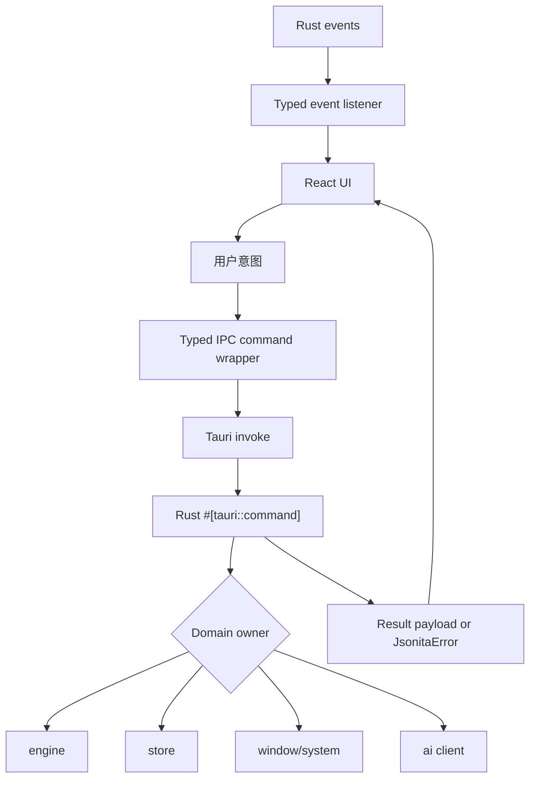
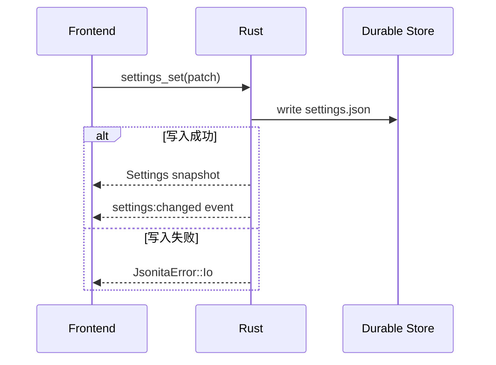
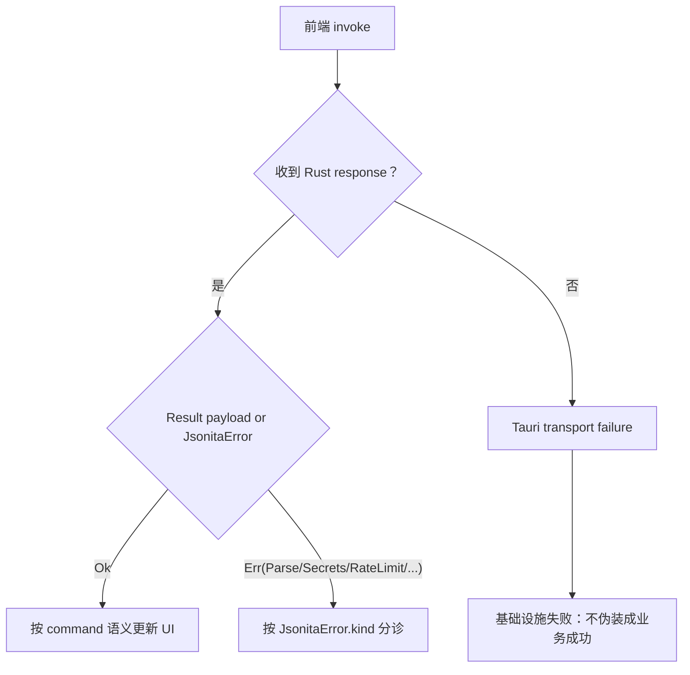

# IPC 边界

IPC 是 Jsonita 的能力网关。WebView 可以表达“我要格式化、保存设置、读剪贴板、请求 AI 修复”，但真正执行这些能力的地方是 Rust。这个边界的价值不是技术分层本身，而是把权限、持久化、网络和失败语义集中在可审计的一侧。

## IPC 网关模型

command 是前端主动请求 Rust 做事；event 是 Rust 告诉前端某个状态变化。event 不能把数据主权移回前端，它只触发 UI 更新或重新拉取。

## Command Group Catalog

| 分组 | 代表 command | Rust owner | TS mirror | 副作用 | 可重试性 |
| --- | --- | --- | --- | --- | --- |
| `json` | `json_format`、`json_minify`、`json_parse`、`json_stringify`、`json_unwrap_stringified` | `cmds::json`、`engine::*` | `src/ipc/commands.ts`、`src/types/commands.ts` | 无持久化副作用 | 可重试，前端用 request sequence 防旧响应。 |
| `history` | `history_add`、`history_list`、`history_search`、`history_pin`、`history_star`、`history_clear` | `cmds::history`、`store::history` | `HistoryRow`、`ListOpts` | 写 SQLite | 写命令不可盲目重复，读命令可重试。 |
| `session` | `session_save_last`、`session_load_last`、`session_clear_last` | `cmds::session`、`store::session` | `LastSession` | 写 SQLite 单行状态 | save/clear 需要按用户意图触发。 |
| `settings` | `settings_get_all`、`settings_set`、`settings_reset` | `cmds::settings`、`store::settings` | `Settings` | 写 `settings.json` 并 emit | patch 失败不能让 UI 假装成功。 |
| `ai` | `ai_set_api_key`、`ai_delete_api_key`、`ai_test_connection`、`ai_has_api_key`、`ai_fix` | `cmds::ai`、`ai::*`、`store::secrets` | `AiFixReq`、`AiFixResp` | secrets 读写或 HTTP | `ai_fix` 用 `requestId` 防混淆；key 保存不可重复伪成功。 |
| `window` | `window_show`、`window_hide`、`window_toggle`、`window_resize_for_content`、`window_set_theme` | `cmds::window`、`window::*`、`store::window` | `ContentMetrics` | 系统窗口和 `window.json` | 可重试，但不能改 editor。 |
| `system` | `clipboard_read`、`open_log_dir`、`open_db_path`、`open_github`、`quit_app` | `cmds::system` | `ClipboardSniff` | 系统能力 | 需要用户动作，不应后台循环。 |
| `shortcuts` | `shortcut_register`、`shortcut_status`、`shortcut_retry`、`open_accessibility_settings` | `shortcuts::*` | `ShortcutRegisterResp` | 全局快捷键 | 注册失败可修改参数后重试；`open_accessibility_settings` 是既有命令名，用户语义是打开 macOS 隐私设置处理快捷键权限。 |
| `logging` | 前端日志薄层、`open_log_dir` | `logging::*`、`cmds::system` | logger service | 写本地日志 | 日志失败不能影响 JSON 主流程。 |

完整签名见 [platform/I01-ipc-api.md](platform/I01-ipc-api.md)。核心 spec 只保留行为判断必需的名字。

## Command 与 Event 的方向性

command response 是调用结果，event 是广播变化。两者都可能更新 UI，但 durable truth 仍在 Rust。比如 `settings:changed` 不是让前端接管 settings 文件，而是告诉前端：Rust 真相已经变了，请同步显示。

关键 event 包括：

| Event | 来源 | 前端用途 |
| --- | --- | --- |
| `settings:changed` | `settings_set` 或 reset 成功 | 更新 settings store 和控件状态。 |
| `window:shown` | window show 成功 | 进入 shown motion、恢复焦点相关 UI。 |
| `window:will-hide` | hide 前 | 播放隐藏过渡。 |
| `window:resized` | resize command 或用户拖拽 | 同步窗口尺寸相关 UI。 |
| `tray:toggle` | 菜单栏点击 | Rust 收到后 toggle window。 |

如果后续新增 event，必须先说明它是“通知”还是“数据同步”，不能让 event 成为新的隐式持久化渠道。

## 类型同步与版本漂移防线

跨 IPC 的字段有两套语言镜像：Rust struct/enum 与 TypeScript type。Rust 内部可以用 snake_case，但序列化给前端时通常是 camelCase。典型例子：

| 行为字段 | Rust/TS 位置 | 为什么核心 spec 要点名 |
| --- | --- | --- |
| `JsonitaError.kind` | `src-tauri/src/error.rs`、`src/types/error.ts` | 前端按 kind 决定 lint、Diff、retry、settings feedback。 |
| `Parse.line/col/msg` | engine error 和 TS mirror | CodeMirror lint 需要位置。 |
| `RateLimit.retryAfterSec` | Rust `retry_after_sec` 序列化 | AI pane 要显示可重试时间。 |
| `AiFixReq.requestId` | TS request、Rust request | 防止重复请求和过期 UI 混淆。 |
| `ContentMetrics.lineCount/bytes/maxLineChars` | smart width | Rust resize 决策依赖前端测量。 |
| `Settings.singlePaneMode/editorSoftWrap/aiEnabled` | settings store | 直接影响 pane 执行和 AI gate。 |

不允许用 `any` 或临时字段绕过类型同步。字段漂移通常不会立刻编译失败，但会让前端误判失败、settings 回滚或窗口 resize。

## 幂等、副作用和重试

| command 类型 | 例子 | 重试规则 |
| --- | --- | --- |
| 纯计算 | `json_format`、`json_minify` | 可重试；前端必须忽略旧响应。 |
| 读操作 | `history_list`、`settings_get_all`、`ai_has_api_key` | 可重试；失败不应改变 UI 真相。 |
| patch 写入 | `settings_set`、`window_resize_for_content` | 只在明确用户动作或 debounce 策略下重试；失败保留旧 durable value。 |
| 追加写入 | `history_add` | 不盲目自动重试，避免重复历史；依赖 content hash 去重也不能替代语义判断。 |
| secret 写入 | `ai_set_api_key`、`ai_delete_api_key` | 失败必须阻止成功态；不能把 key 放到重试日志里。 |
| 外部网络 | `ai_fix`、`ai_test_connection` | 保留 requestId 和 retry-after；不能自动无限重试。 |
| 系统动作 | `quit_app`、`open_log_dir`、`open_accessibility_settings` | 需要用户触发；失败反馈但不污染 JSON 状态。 |

## 业务错误 vs transport 错误

业务错误是 Rust 已经理解了请求并返回 `JsonitaError`。transport 错误是 IPC 本身没有完成。前端必须区分它们：`Parse` 可以显示 line/col；transport failure 不能伪造成 parse failure，也不能写 history。

## IPC 失败矩阵

| 场景 | 触发点 | 不变量 | 用户可见结果 | 可继续动作 | 日志边界 |
| --- | --- | --- | --- | --- | --- |
| `Parse` | `json_*` command | input 不变，过期 response 不生效 | invalid + lint | 继续编辑、AI Fix | 记录 kind 和位置，不记内容。 |
| `Secrets` | `ai_set_api_key` 或 `ai_fix` 读 key | key 不进入 settings/event/log | 保存失败或 AI 不启动 | 修正权限、重试保存 | 不记录 key。 |
| `Sqlite` | history/session command | editor 内存态不丢 | 历史或恢复动作失败 | 继续编辑、查看日志 | 可记录表/动作，不记 JSON。 |
| `Io` | settings/window/log/system 文件动作 | durable old value 保持 | action 失败提示 | 重试或打开 support | 不写敏感 payload。 |
| `RateLimit` | AI HTTP | Diff 不出现 | 显示 retry-after | 稍后重试 | 记录 status/retryAfterSec/requestId。 |
| Transport failure | Tauri invoke/listen | 不产生半成功状态 | 基础设施错误 | 重试或重启 | 记录 command 名和错误摘要。 |

## FAQ

**为什么 Event 不能直接携带所有持久化数据？**
event 是通知机制，不是第二套 store。把完整 durable state 塞进 event 会让前端误以为自己拥有真相，并扩大敏感数据泄漏面。

**为什么不能在前端临时 `any`？**
IPC 字段一旦漂移，错误分诊、settings patch 和 AI retry 都会变成运行时 bug。类型镜像是边界契约的一部分。

**transport failure 要怎么显示？**
显示为基础设施失败，而不是具体业务失败。前端没有拿到 `JsonitaError.kind` 时，不能编造 `Parse`、`Secrets` 或 `Sqlite`。

**什么时候可以自动重试？**
纯计算和读操作可以谨慎重试；写入、secrets、AI 网络和系统动作必须尊重用户意图和副作用。

## 相关文档

- 错误分诊见 [S03-error-model.md](S03-error-model.md)。
- 前端过期响应和 input 覆盖规则见 [M00-frontend-execution.md](M00-frontend-execution.md)。
- 完整 command/event 和 schema 见 [platform/I01-ipc-api.md](platform/I01-ipc-api.md) 与 [appendix/A00-schemas.md](appendix/A00-schemas.md)。
