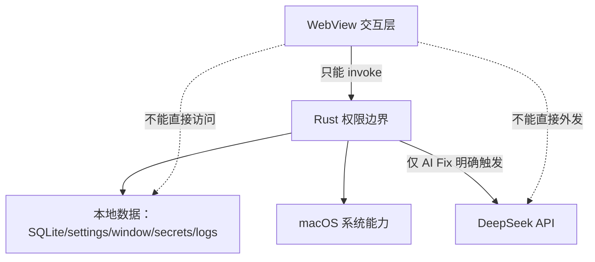
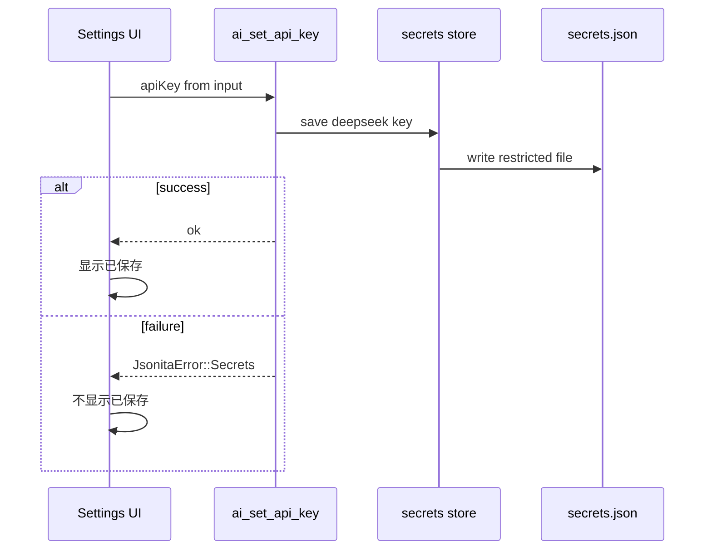

# 安全与隐私

Jsonita 的安全模型很朴素：默认本地，外发必须有用户动作，日志不能变成用户数据副本。它处理的 JSON 往往来自生产接口、日志、配置或业务数据，所以安全边界要比一个普通小工具更严格。

## Threat Model

WebView 被当作不可信 UI 环境处理。它可以展示、编辑、复制、触发命令，但不能直接读写 filesystem、SQLite、secrets、网络或日志文件。Rust 是权限边界，也是审计边界。

## 数据资产清单

| 数据资产 | 存放位置 | 谁能读取 | 是否可外发 | 是否可入日志 | 关键规则 |
| --- | --- | --- | --- | --- | --- |
| 当前 editor input | WebView 内存 | WebView，Rust command 临时接收 | 只有用户触发 AI Fix 时可发送当前请求文本 | 否 | preview、parse、Tree 不能把它写入日志。 |
| `history` | SQLite | Rust store | 否 | 否 | 记录合法操作历史，不作为 AI 上下文。 |
| `last_session` | SQLite | Rust store | 否 | 否 | 用于恢复，不因 hide/quit 自动更新。 |
| `settings.json` | app data 文件 | Rust settings store，前端只拿 snapshot | 否 | 只可记录 key 名，不记录敏感值 | 默认值由 Rust 补齐。 |
| `window.json` | app data 文件 | Rust window store | 否 | 可记录尺寸来源，不记录内容 | 只存窗口运行状态。 |
| `secrets.json` | app data 文件，受限权限 | Rust secrets store | 仅作为 Authorization secret 使用，不作为 payload 外发 | 否 | 不进入 settings/event/log。 |
| logs | 本地 rolling JSONL | 用户和 Rust logging | 用户主动导出时可离开本机 | 本身是日志 | 必须脱敏，不包含 JSON 文档和 API key。 |
| DeepSeek request | 网络请求 | Rust AI client | 是，用户触发 AI Fix | 否 | 只包含当前待修复文本和 parse context。 |

## Secrets 生命周期

`secrets.json` 是 v1 beta 的 API key 存储路径。项目明确不把 Keychain 作为产品存储路径，因为 Keychain 会把当前 beta 绑定到 codesign identity、系统弹窗、迁移和调试不稳定性上。

核心语义只点名到 `accounts.deepseek_api_key.value` 级别：它是 DeepSeek key 的本地存储位置。完整 JSON 结构在 [appendix/A00-schemas.md](appendix/A00-schemas.md)。

测试连接走 `ai_test_connection(apiKey, modelId)`，直接使用输入框当前值，不依赖、也不覆盖已保存 key。这样用户可以测试新 key，而不会在测试失败时污染已保存 secret。

## AI 外发白名单

AI 默认关闭。即使前端误显示入口，Rust `ai_fix` 仍必须检查 `aiEnabled` 和 API key。

允许进入 DeepSeek request 的只有：

| 字段 | 来源 | 为什么需要 |
| --- | --- | --- |
| 当前 editor text | 用户当前请求 | 模型要修复的唯一内容。 |
| `errorLine` / `errorCol` | `Parse` payload | 帮模型定位错误。 |
| `errorMsg` | `Parse` payload | 给模型最小错误上下文。 |
| request model 和默认参数 | settings / AI client | 控制请求行为。 |

明确禁止进入 prompt 或 HTTP payload 的内容：

- history 记录。
- settings 全量配置。
- `secrets.json` 内容。
- 本地日志。
- window state。
- 剪贴板全文，除非它就是当前 editor input 且用户触发 AI Fix。

AI provider 接入边界见 [platform/I00-ai-provider-protocol.md](platform/I00-ai-provider-protocol.md)，wire protocol 和 prompt 模板见 [appendix/A05-ai-protocol-details.md](appendix/A05-ai-protocol-details.md)。

## 日志 deny list

日志是本地 support 工具，不是 telemetry。日志字段的默认策略是 allow-list，以下类别一律不能写入：

| 禁止类别 | 例子 |
| --- | --- |
| JSON 内容 | `content`、`input`、`output`、`before`、`after`、history row body。 |
| secrets | `apiKey`、`token`、Authorization header、`deepseek_api_key.value`。 |
| prompt | `prompt`、`rawPrompt`、包含用户 JSON 的 system/user message。 |
| 剪贴板全文 | `clipboardText`、完整 paste preview。 |
| AI raw output | `raw`、未脱敏模型原文。 |

如果脱敏失败，宁可丢字段，也不能写出敏感内容。完整日志字段和 allow/deny list 见 [appendix/A03-logging-details.md](appendix/A03-logging-details.md)。

## 权限和能力边界

| 能力 | 为什么放 Rust | 安全约束 |
| --- | --- | --- |
| 文件读写 | settings、window、secrets、logs 都需要权限和脱敏 | WebView 不直接接触路径和文件句柄。 |
| SQLite | history/session 需要事务、迁移、裁剪 | 前端不能直接打开 DB。 |
| DeepSeek HTTP | 需要 API key、timeout、错误映射 | WebView 不持有 key。 |
| 全局快捷键 | macOS 权限和冲突处理 | 失败可恢复，不阻塞 tray。 |
| 打开日志/DB 路径 | 系统动作 | 必须是用户触发。 |

Tauri capabilities 和 entitlements 只开放实际需要的 command 能力，完整配置见 [appendix/A04-packaging-details.md](appendix/A04-packaging-details.md)，release 门禁见 [platform/R00-release-readiness.md](platform/R00-release-readiness.md)。

## 发布前安全清单

安全清单按发布范围执行。内部 beta 的未签名/未公证不是隐形债务，必须在 release notes 中明示；公开 release、App Store、企业分发或自动更新通道必须先关闭完整清单。

| 检查项 | 当前 v1 beta 结论 | 公开分发要求 |
| --- | --- | --- |
| 本地数据路径 | SQLite/settings/window/secrets/logs 路径已定义。 | 文档和 support 入口必须可查。 |
| secrets 存储 | 使用 `secrets.json`，不使用 Keychain。 | 复核文件权限和日志脱敏。 |
| 网络外发 | 只有用户主动 AI Fix 发送当前文本到 DeepSeek。 | 隐私说明必须同步到公开渠道。 |
| 日志 | rolling JSONL，7 days，禁止 JSON/API key/prompt/raw output。 | export/support 流程必须维持脱敏边界。 |
| entitlements | DeepSeek network client true；Apple Events/JIT/unsigned memory/library validation false。 | 任一权限扩大都需要 spec 和 release gate 记录。 |
| signing / notarization | 内部 beta 可 unsigned/未公证。 | Developer ID signing + notarization + staple。 |

## 隐私失败矩阵

| 场景 | 触发点 | 不变量 | 用户可见结果 | 可继续动作 | 日志边界 |
| --- | --- | --- | --- | --- | --- |
| `Secrets` 写失败 | 保存 API key | settings 不含明文 key，UI 不显示保存成功 | API key 保存失败 | 修复权限或重试 | 只写 operation 和 kind，不写 key。 |
| AI disabled | `ai_fix` 被调用 | 不发 HTTP | AI 入口禁用或错误提示 | 用户可在 settings 启用 | 写 `AiDisabled`，不写 prompt。 |
| AI key 缺失 | `ai_fix` 读 key | 不发 HTTP | 提示配置 key | 输入并保存 key | 不写 key/path 明细。 |
| 日志脱敏失败 | logging writer 处理字段 | 不写敏感字段 | 主流程继续，support 能力降低 | 查看基础错误 | 丢弃字段优先。 |
| WebView 组件误传敏感字段 | frontend logger payload | Rust 二次脱敏 | 不应泄漏到文件 | 修复前端事件 | writer deny list 兜底。 |
| 用户导出日志 | support action | 不附带 DB/settings/secrets/JSON | 生成可分享日志包或失败提示 | 用户决定是否发送 | 只包含允许字段。 |

## FAQ

**为什么不用 Keychain？**
当前 v1 beta 更需要可调试、可迁移、可验证的本地文件存储。Keychain 会引入 codesign identity、系统授权弹窗和迁移成本，不适合当前产品阶段。

**AI 会不会读取 history 或 settings？**
不会。AI Fix 只发送当前待修复文本和最小 parse context。history/settings/logs/window/secrets 都不是 prompt 上下文。

**测试连接会保存 key 吗？**
不会。`ai_test_connection` 使用输入框里的临时 key，只有 `ai_set_api_key` 成功才写 `secrets.json`。

**日志为什么不能记录 JSON？没有内容怎么排查？**
大多数问题可以用 command、kind、line/col、duration、status、requestId 定位。记录 JSON 内容会把 support 日志变成隐私风险。

## 相关文档

- 数据所有权见 [S05-storage-session.md](S05-storage-session.md)。
- AI 修复外发流程见 [M02-ai-repair.md](M02-ai-repair.md)。
- 日志脱敏见 [S06-logging-observability.md](S06-logging-observability.md)。
- secrets/settings schema 见 [appendix/A00-schemas.md](appendix/A00-schemas.md)。
