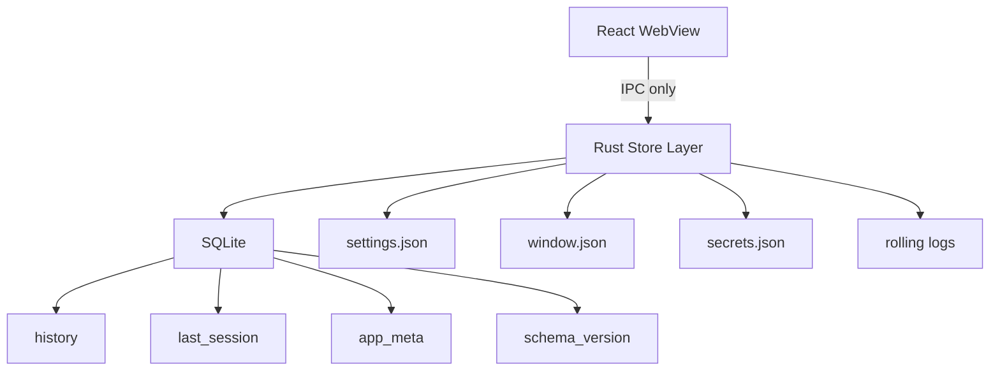
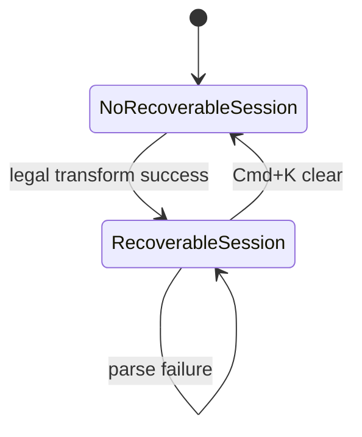
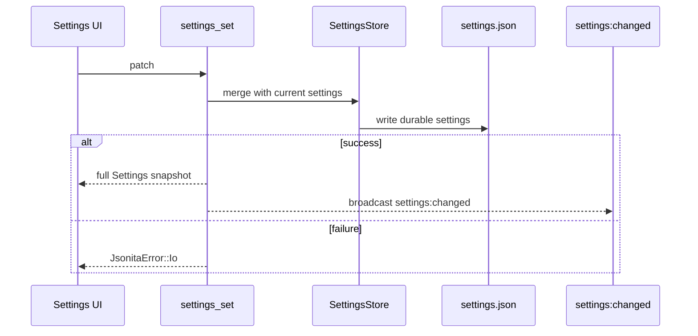

# 存储与会话

Jsonita 的本地数据不是一个“配置文件夹”能概括的东西。history 是账本，last_session 是恢复指针，settings 是用户偏好，window state 是运行时记忆，secrets 是凭证，logs 是诊断材料。它们混在一起会导致恢复错乱、隐私泄漏和难以排查的状态漂移。

## 数据主权地图

WebView 可以请求读写，但不拥有这些数据。Rust store 是唯一写入者。

## 数据账本

| 数据 | 介质 | 关键名字 | 写入时机 | 恢复时机 | 失败后保持什么 |
| --- | --- | --- | --- | --- | --- |
| History | SQLite `history` | `contentHash`、`opType`、`pinned`、`starred`、created timestamp | 合法操作完成并明确加入历史 | 用户打开 history 或 search | 当前 editor 内存态保持。 |
| Last Session | SQLite `last_session` | `content`、`opType`、`savedAt` | 合法 transform 成功或显式 save | restore last command | 旧 last_session 保持。 |
| App meta | SQLite `app_meta` | key/value metadata | 迁移或内部状态 | 启动/迁移 | 不影响当前编辑。 |
| Schema version | SQLite `schema_version` | migration version | migration 成功 | DB open | migration 失败阻断相关 store。 |
| Settings | `settings.json` | `singlePaneMode`、`editorSoftWrap`、`aiEnabled` 等 | `settings_set` / reset 成功 | 启动和 `settings_get_all` | durable old value 保持。 |
| Window state | `window.json` | size、smart resize lock、theme effective state | resize/theme/window command | 启动和 resize | 默认尺寸或旧值。 |
| Secrets | `secrets.json` | `accounts.deepseek_api_key.value` | `ai_set_api_key` 成功 | AI command 需要 key 时 | 旧 key 或无 key 保持。 |
| Logs | rolling files | `ts`、`event`、`kind`、`requestId` | runtime event | support export/open | 主流程继续。 |

完整 DDL、PRAGMA 和 schema 展开见 [appendix/A01-storage-details.md](appendix/A01-storage-details.md) 与 [appendix/A00-schemas.md](appendix/A00-schemas.md)。

## History 与 Last Session 为什么分开

history 回答“我以前处理过什么”，last_session 回答“我现在按恢复应该拿回什么”。这两个问题相似但不相同：

| 场景 | history | last_session |
| --- | --- | --- |
| format 成功 | 可追加或去重 | 可更新为当前内容和 opType。 |
| parse 失败 | 不写 | 不写。 |
| hide/close | 不写 | 不写。 |
| quit | 不写 | 不写。 |
| `Cmd+K` 清空 | 不一定清 history | 清 last_session。 |
| pin/star 历史 | 改 history metadata | 不影响 last_session。 |

如果关闭窗口会覆盖 last_session，用户就可能恢复到一个无意义的空白或半编辑状态；如果 history 和 last_session 共用同一条记录，清空恢复目标可能误删历史。

## Settings Patch 协议

前端不能在多个地方自造默认值。旧 settings 缺字段时，由 Rust store 补默认值，并返回完整 snapshot。patch 失败时，UI 应回到 durable old value 或明确显示失败。

## Window State 与 Secrets 的隔离

window state 是运行时记忆，不是产品数据。它可以记录用户尺寸和智能缩放状态，但不持久化屏幕绝对位置，因为多屏环境变化会让窗口恢复到不可见区域。窗口默认定位以当前鼠标所在屏为准。

secrets 是凭证，不是 settings。settings 可以显示“是否存在 key”的状态，但不能返回明文 key。`ai_test_connection` 使用输入框当前 key，不依赖保存值；`ai_set_api_key` 成功后才更新已保存状态。

## SQLite 可靠性策略

SQLite 用于 history、last_session、app_meta 和 schema_version，是因为这些数据需要查询、去重、事务和迁移。可靠性策略包括：

| 策略 | 用途 |
| --- | --- |
| migration 顺序执行 | 保证老版本 DB 可升级。 |
| `schema_version` | 记录已应用版本。 |
| WAL | 降低读写互相阻塞。 |
| `busy_timeout` | 避免短暂锁冲突直接失败。 |
| connection pool | 支撑多个 command 访问 store。 |
| `contentHash` | 支持历史去重和快速识别内容。 |

这些细节的具体值和 DDL 放在 [appendix/A01-storage-details.md](appendix/A01-storage-details.md)。核心 spec 只要求实现遵守这些策略名和语义。

## 存储失败矩阵

| 场景 | 触发点 | 不变量 | 用户可见结果 | 可继续动作 | 日志边界 |
| --- | --- | --- | --- | --- | --- |
| DB open 失败 | 启动 setup | JSON 临时编辑仍可工作 | history/session 后续不可用或失败 | 继续做无持久化变换 | 记录 path category 和错误摘要，不写内容。 |
| migration 失败 | SQLite 初始化 | 不使用半迁移数据 | storage 功能失败 | 查看日志、备份 DB、重启 | 记录 migration version 和错误。 |
| history 写失败 | `history_add` | editor input/output 不回滚 | 历史保存失败 | 继续编辑，稍后重试 | 不写 JSON 内容。 |
| last_session 写失败 | preview/transform 成功后的 save | 当前编辑内存态不丢 | 恢复能力不承诺成功 | 继续编辑 | 记录 `Sqlite` 和 action。 |
| settings 写失败 | `settings_set` | durable old settings 保持 | 控件失败反馈或回滚 | 重试 | 不写 secrets 或 JSON。 |
| window.json 写失败 | resize/theme | JSON 主流程不阻塞 | resize 可能不记忆 | 继续编辑 | 只写尺寸来源和 kind。 |
| secrets 写失败 | `ai_set_api_key` | key 不泄漏，不显示保存成功 | 保存失败 | 修复权限、重试 | 不写 key。 |

## FAQ

**关闭窗口为什么不写 last_session？**
关闭只是隐藏。last_session 是恢复语义，必须来自合法业务动作；窗口生命周期不代表用户想保存这个状态。

**`Cmd+K` 为什么要清 last_session？**
因为清空是明确用户动作。如果不清，用户之后恢复可能拿回刚刚决定丢掉的内容。

**settings 写失败时 UI 要不要保持新值？**
不应该。新值没有成为 durable truth，UI 应回到 Rust 返回的真实状态或显示保存失败。

**history 写失败要不要阻止当前 JSON 操作？**
不阻止当前编辑和结果展示。history 是附加账本，不是 transform 成功的前提；但不能假装历史已保存。

## 相关文档

- 系统数据流见 [S00-system-architecture.md](S00-system-architecture.md)。
- 前端保存和清空动作见 [M00-frontend-execution.md](M00-frontend-execution.md)。
- 错误分诊见 [S03-error-model.md](S03-error-model.md)。
- SQLite DDL、PRAGMA、迁移和字段完整表见 [appendix/A01-storage-details.md](appendix/A01-storage-details.md) 与 [appendix/A00-schemas.md](appendix/A00-schemas.md)。
