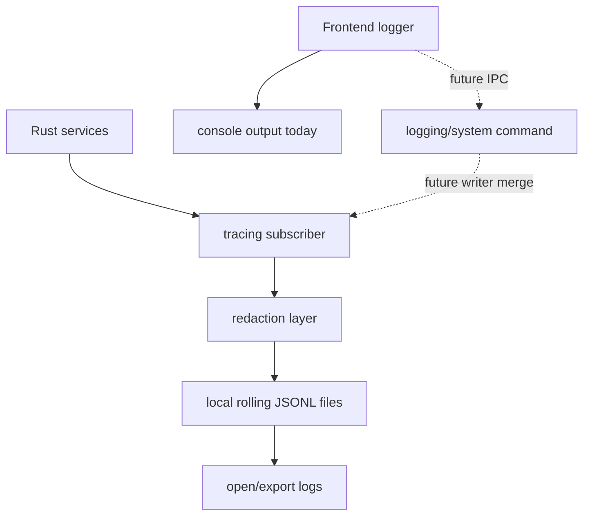
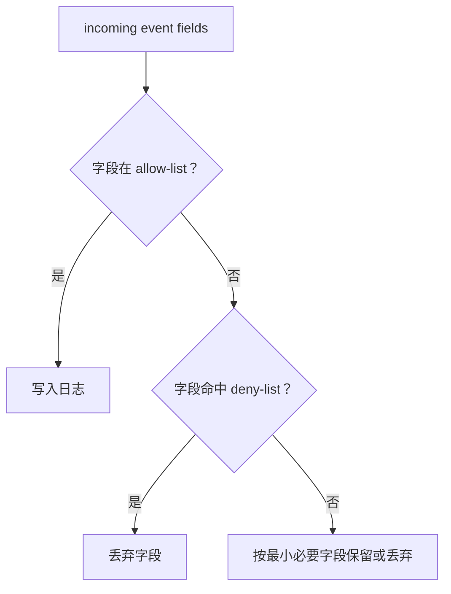
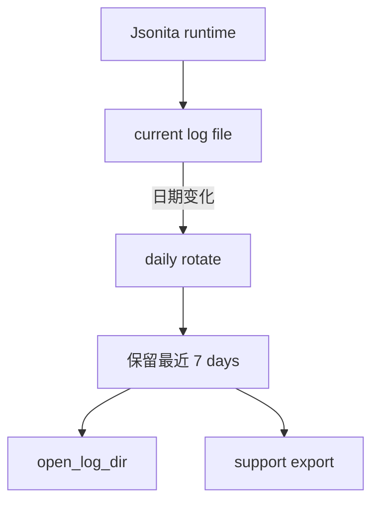

# 日志与可观测性

Jsonita 的日志不是 telemetry。它不远程上报，不记录用户 JSON，不记录 API key。它只服务两个场景：开发者定位本地问题，用户在 support 流程里主动导出诊断材料。

## 事件从哪里来

Rust 是当前 durable writer。前端 logger 现在只保留 API shape 并输出 console；未来如果接入 IPC，也只能上报薄层诊断事件，不能直接写文件。写入前后都要遵守脱敏边界。

## JSONL 字段契约

核心日志字段必须稳定，便于 support 和开发者 grep：

| 字段 | 含义 | 是否必需 | 例子 |
| --- | --- | --- | --- |
| `ts` | 时间戳 | 是 | app start、command error 都需要。 |
| `level` | `INFO`、`WARN`、`ERROR` | 是 | 失败使用 warn/error。 |
| `event` | 事件名 | 是 | `app.start`、`command.error`、`ai.http_error`。 |
| `requestId` | 请求关联 ID | 有 request 时 | AI Fix、长命令。 |
| `durationMs` | 耗时 | 命令/网络/导出 | 性能诊断。 |
| `kind` | `JsonitaError.kind` | 错误时 | `Parse`、`RateLimit`、`Secrets`。 |
| `status` | HTTP 或 action 状态 | 相关事件 | DeepSeek status、export status。 |
| `source` | 前端/Rust/模块来源 | 建议 | `frontend`、`rust`、`ai`、`store`。 |
| `fields` | allow-list 扩展字段 | 可选 | line/col、retryAfterSec、window size source。 |

完整字段表在 [appendix/A03-logging-details.md](appendix/A03-logging-details.md)。核心 spec 点名这些字段，是因为它们影响错误定位和隐私边界。

## 事件分类和诊断目标

| 分类 | 事件例子 | support 价值 | 禁止字段 |
| --- | --- | --- | --- |
| lifecycle | `app.start`、`window.show`、`window.hide`、`app.quit` | 启动、隐藏、退出问题 | editor content。 |
| command | `command.start`、`command.success`、`command.error` | IPC 成功率和耗时 | command payload 中的 JSON 文本。 |
| storage | `db.open`、`db.migration`、`settings.write`、`secrets.write` | 本地数据问题 | row content、API key。 |
| ai | `ai.request_start`、`ai.http_error`、`ai.invalid_json` | AI 修复问题 | prompt、raw output、key。 |
| window | `resize.auto`、`resize.user`、`theme.applied` | 浮窗尺寸和主题问题 | JSON 内容。 |
| logging | `log.open`、`log.export`、`log.write_error` | support workflow 自身 | 导出包外的敏感材料。 |
| shortcut | `shortcut.registered`、`shortcut.register_failed` | 权限和冲突问题 | 当前前台 app 的敏感上下文。 |

## Redaction Policy

deny-list 类别在 [S04-security-privacy.md](S04-security-privacy.md) 定义。日志系统必须做二次脱敏，即使前端已经声称 payload 是安全的。

字段策略：

| 类型 | 允许 | 禁止 |
| --- | --- | --- |
| JSON parse | `line`、`col`、`kind` | `input`、`output`、`content`。 |
| AI | `requestId`、`status`、`retryAfterSec`、`durationMs` | prompt、raw output、API key。 |
| storage | action、table/category、kind | row content、history body。 |
| settings | changed key names | secret values、完整 settings dump。 |
| window | width/height/source | editor text。 |

## Rolling Files 与 Support Flow

日志保存在本地 rolling files。当前实现按天滚动，并清理超过 `7 days` 的旧日志；文件权限通过 POSIX umask 和既有文件权限修正收敛到当前用户可读写。这样可以避免日志无限增长，同时保留最近问题上下文。

support flow：

1. 用户从 About 或系统命令打开日志目录。
2. 用户主动选择是否分享日志。
3. 导出或分享只包含允许字段和日志文件。
4. 不自动附带 SQLite、settings、secrets 或 JSON 文档。

## 日志失败矩阵

| 场景 | 触发点 | 不变量 | 用户可见结果 | 可继续动作 | 日志边界 |
| --- | --- | --- | --- | --- | --- |
| writer 初始化失败 | app start | JSON 主流程不因日志失败而写敏感替代物 | support 能力下降 | 继续或退出，视启动策略 | 不能把日志写到未审计位置。 |
| 写日志失败 | runtime event | JSON transform 不回滚 | 通常用户无感，support action 可提示 | 继续编辑 | 不能把失败 payload dump 到 stderr 造成泄漏。 |
| 存储恢复事件 | SQLite/settings/window load 或恢复 | 当前 editor 和敏感数据不进入日志 | 用户可能看到恢复、重置或无持久化提示 | 继续编辑，按 S05 恢复 | 只写 category、action、fallback、kind 和 path category。 |
| 打开日志目录失败 | `open_log_dir` | 不影响 editor | support action failure | 重试或手动定位 | 可显示错误摘要。 |
| 导出失败 | support export | 不附带未脱敏材料 | export failure | 重试 | 不创建半脱敏包。 |
| redaction 不确定 | 处理字段时 | 敏感数据不写入 | 字段缺失但主流程继续 | 修复字段 allow-list | 宁可丢字段。 |

## 存储恢复日志事件

存储恢复事件需要足够定位“哪个本地账本坏了、系统用了什么 fallback”，但不能把损坏文件内容写入日志。

| event | category | action | fallback | 允许字段 | 禁止字段 |
| --- | --- | --- | --- | --- | --- |
| `storage.recovery` | `sqlite` | `integrity-check-failed` / `migration-failed` / `open-failed` | `disabled` / `new-empty-db` / `user-action-required` | `kind`、`schemaVersion`、path category、error summary | history row、last_session content、raw SQL dump。 |
| `storage.recovery` | `settings` | `parse-failed` / `schema-failed` | `defaults` | `kind`、changed key names if known、path category | 完整 settings JSON、secret-like value。 |
| `storage.recovery` | `window` | `parse-failed` / `schema-failed` / `size-clamped` | `defaults` / `clamped` | width/height、source、path category | editor text、screen contents。 |

path category 只能写 `app-data/sqlite`、`app-data/settings`、`app-data/window` 这类类别，不写用户 home 下的完整绝对路径。错误摘要需要截断，并通过 redaction layer 二次过滤。

## FAQ

**为什么日志不是 telemetry？**
Jsonita 是本地工具，用户数据默认留在本机。远程 telemetry 会改变隐私承诺，也不是 v1 beta 需要的能力。

**不记录 JSON 内容还能排查 parse 问题吗？**
能。`Parse` 的 line/col/msg、command、duration、版本号通常足够定位实现问题；需要具体输入时应由用户主动提供最小复现。

**日志写失败是否影响 JSON 变换？**
不应该。日志是诊断附属能力，不能让 format/minify/Tree/AI Diff 因为日志文件失败而崩溃。

**AI raw output 能否为了 debug 写日志？**
默认不能。raw output 很可能包含用户 JSON。除非未来有明确、用户主动、脱敏可验证的 debug export 机制，否则不写。

## 相关文档

- 错误字段边界见 [S03-error-model.md](S03-error-model.md)。
- 隐私 deny-list 见 [S04-security-privacy.md](S04-security-privacy.md)。
- logging command 明细和事件 catalog 见 [appendix/A03-logging-details.md](appendix/A03-logging-details.md) 与 [platform/I01-ipc-api.md](platform/I01-ipc-api.md)。
