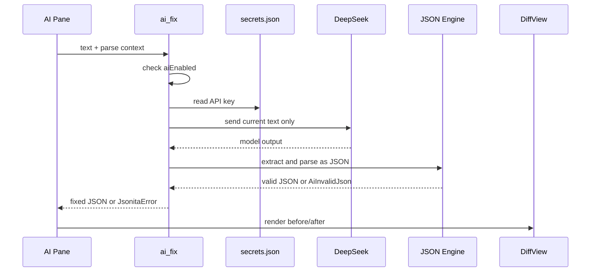

# I00 · AI Provider Protocol

AI provider protocol 定义 Jsonita 如何把本地 AI Repair 能力接到 DeepSeek，同时保持“用户触发、最小外发、本地校验、用户确认”的边界。它不是 prompt 模板仓库；完整 prompt、wire 参数、响应抽取和 Diff props 放在 [../appendix/A05-ai-protocol-details.md](../appendix/A05-ai-protocol-details.md)。

## 负责什么

| 负责 | 不负责 |
| --- | --- |
| 定义何时允许调用 DeepSeek。 | 不定义 editor 状态机；见 [../M00-frontend-execution.md](../M00-frontend-execution.md)。 |
| 定义 provider 失败如何映射回 AI Repair。 | 不保存完整 prompt 模板；见 [../appendix/A05-ai-protocol-details.md](../appendix/A05-ai-protocol-details.md)。 |
| 定义返回内容必须先本地校验再进入 Diff。 | 不定义 JSON parse/format 算法；见 [../M01-json-engine.md](../M01-json-engine.md)。 |
| 定义 secrets、settings、日志的跨边界限制。 | 不定义 secrets schema；见 [../appendix/A00-schemas.md](../appendix/A00-schemas.md)。 |

## 接入边界

DeepSeek never becomes a source of truth. It can propose a repaired document, but only Rust validation can mark that proposal usable, and only the user can accept it into the editor.

## 输入输出契约

| 方向 | 允许内容 | 禁止内容 |
| --- | --- | --- |
| UI -> Rust | 当前 editor text、parse line/column/message、model id。 | history、settings 全量、logs、window state、raw secrets。 |
| Rust -> DeepSeek | 当前 repair request 所需文本和最小错误上下文。 | 任何非当前请求的数据。 |
| DeepSeek -> Rust | Candidate JSON text。 | 解释性 markdown 不可信；只能被抽取和校验。 |
| Rust -> UI | verified fixed JSON 或 `JsonitaError`。 | 未校验 raw output 不能进入 Diff accept path。 |

## 失败语义

| 失败 | 停在哪里 | 用户看到什么 | 数据规则 |
| --- | --- | --- | --- |
| AI disabled | `ai_fix` 前置检查 | AI pane 提示需要启用 | 不发 HTTP，不读 key。 |
| No API key | secrets store | 提示配置 key | 不发 HTTP，不写 settings。 |
| HTTP / timeout | provider client | AI pane 显示网络或状态码错误 | input 保持，Diff 不出现。 |
| Rate limit | provider client | 显示 retry-after 或限流提示 | input 保持，可重试。 |
| Invalid provider output | Rust extraction / JSON Engine | 提示 AI 返回不可用 | 不显示 Accept，不覆盖 editor。 |

## 降级与恢复

| 场景 | 降级策略 | 恢复动作 |
| --- | --- | --- |
| Provider 不可用 | JSON format/minify/Tree 继续可用。 | 用户稍后重试或关闭 AI。 |
| Key 保存失败 | Settings 不显示保存成功。 | 修复权限后重新保存。 |
| 模型返回解释文字 | Rust 只尝试抽取 JSON；抽取失败则报 `AiInvalidJson`。 | 用户重试或手动修。 |
| 输出合法但不满意 | DiffView 允许 Reject。 | 用户保留原文继续编辑。 |

## FAQ

| 问题 | 答案 |
| --- | --- |
| 为什么 prompt 不放在 I00？ | Prompt 是实现明细；I00 只定义 provider 接入边界和失败收场。 |
| Provider 返回合法 JSON 就能自动覆盖吗？ | 不能。合法 JSON 只进入 Diff，Accept 才能覆盖 input。 |
| AI Fix 会读取 history 吗？ | 不会。provider request 只包含当前 editor text 和最小 parse context。 |
| 为什么 `ai_test_connection` 不读取已保存 key？ | 用户测试的是输入框当前 key，测试失败不能污染已保存 secret。 |
