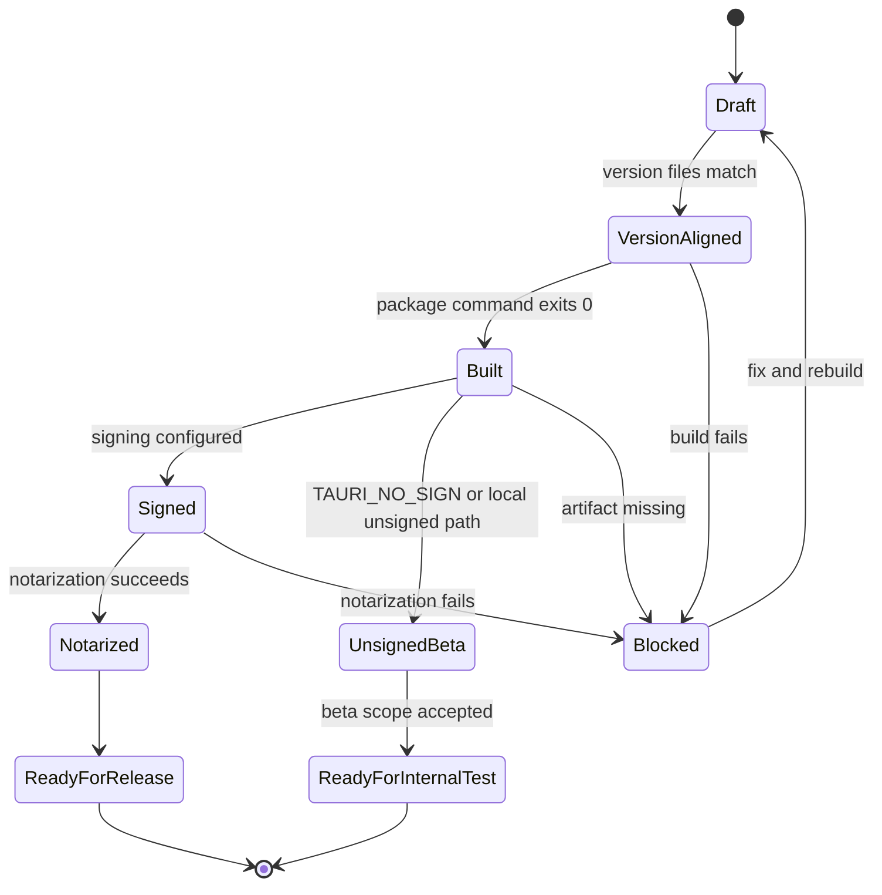

# R00 · Release Readiness

Release readiness 是 Jsonita 从本地 commit 变成可交付安装包之前的可靠性门禁。它不关心“命令怎么拼”这种明细；它关心一次 release 是否有一致版本、可解释产物、明确签名状态、可复现验证和失败收场。

## 负责什么

| 负责 | 不负责 |
| --- | --- |
| 定义 release 前必须通过的门禁。 | 不保存完整 Tauri config。 |
| 定义签名、公证、未签名内测包的用户可见含义。 | 不保存所有 shell 命令和环境变量。 |
| 定义 release 失败时能否继续发包。 | 不替代 GitHub Release 页面文案。 |
| 定义构建产物和版本号是否一致。 | 不重新解释产品分发路线图；路线图见 [../S07-packaging-distribution.md](../S07-packaging-distribution.md)。 |

完整命令、Tauri 配置、capabilities、entitlements 和环境变量见 [../appendix/A04-packaging-details.md](../appendix/A04-packaging-details.md)；验证矩阵见 [../appendix/V00-validation-matrix.md](../appendix/V00-validation-matrix.md)。

## Release 状态机

## 门禁

| 门禁 | 必须满足 | 失败收场 |
| --- | --- | --- |
| 版本一致 | `package.json`、`src-tauri/Cargo.toml`、`src-tauri/tauri.conf.json`、About panel 显示一致。 | 阻断 release；只允许回到版本同步修改。 |
| 产物可解释 | 当前 release scope 的产物输出到约定目录，文件名能对应当前版本。v1 beta scope 要求 macOS `.dmg`，`.app` 可用于本地 smoke test；Windows NSIS 是脚本预留，不阻断当前 beta。 | 阻断 release；不能用旧产物顶替。 |
| 签名状态明确 | 对外 release 需要 Developer ID 签名和 notarization；小范围 beta 可以明确标注 unsigned。 | 对外 release 阻断；内部 beta 必须在 release notes 明说。 |
| 隐私边界保留 | 打包配置只开放 DeepSeek 网络例外和必要 Tauri capabilities。 | 阻断 release；不能以“先发包”为理由扩大权限。 |
| 安全合规清单关闭 | 当前发布范围对应的签名、公证、权限、隐私、数据保留、secrets 和分发通道要求已在 [../S07-packaging-distribution.md](../S07-packaging-distribution.md) 逐项满足或明确后置。 | 阻断超出范围的发布；内部 beta 只能带着明确限制发布。 |
| 验证记录完整 | 本次改动范围对应的 build/test/doc checks 已跑，并把失败项留在 TODO 或修掉。 | 阻断 release；不能把未跑验证写成通过。 |

## 用户可见结果

| 状态 | 用户看到什么 | 项目记录 |
| --- | --- | --- |
| Ready for internal test | GitHub Release 附 `.dmg`，release notes 明确 beta/unsigned 限制。 | [../../CHANGELIST.md](../../CHANGELIST.md) 记录发包事实和验证。 |
| Ready for release | GitHub Release 附签名、公证后的 `.dmg` 或目标平台安装包。 | README 安装入口可以指向 latest release。 |
| Blocked | 没有新 release；TODO 保留阻断原因。 | [../../TODO.md](../../TODO.md) 只保留仍开放的问题。 |

## FAQ

| 问题 | 答案 |
| --- | --- |
| 为什么 release 可靠性不放在 appendix？ | 因为它决定能不能发包，是行为门禁，不是命令明细。 |
| 为什么命令还在 appendix？ | 命令和变量是查表信息；读者理解 release 契约时不需要先背它们。 |
| unsigned beta 能不能发？ | 可以小范围发，但必须在 release notes 和项目记录中明示，不得伪装成正式签名版本。 |
| Homebrew、updater、npm wrapper 算不算 release readiness？ | 当前 v1 beta 不算。它们是 v1.1+ 分发能力，只有真实产物 URL 和 sha256 存在后才进入门禁。 |
